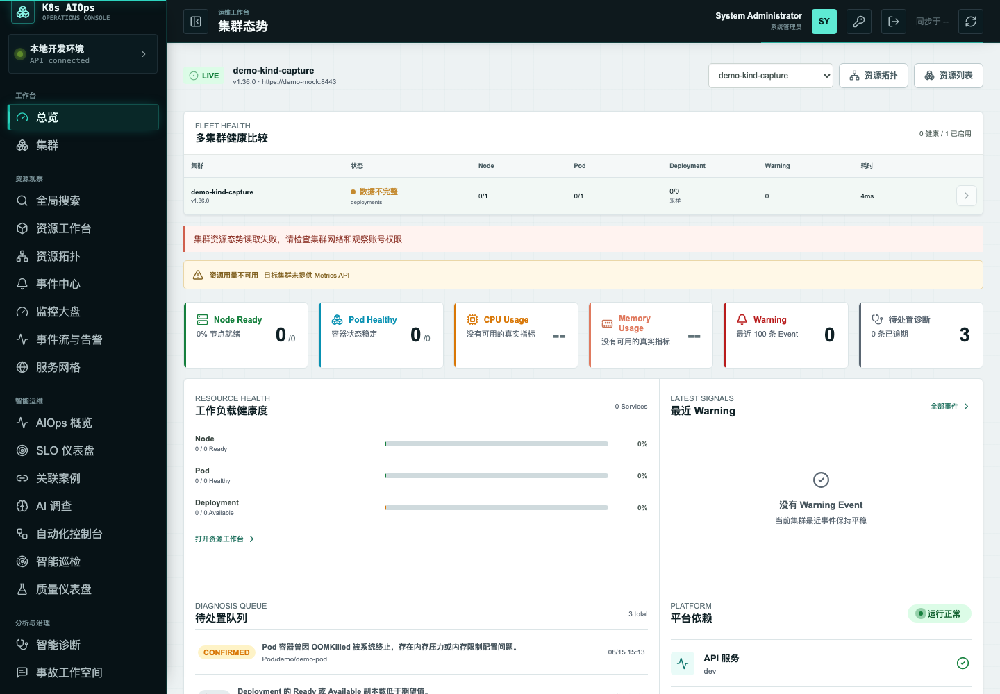
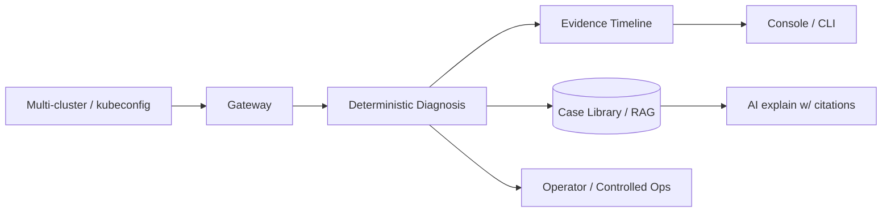

# AIOps Platform

**Kubernetes fault diagnosis with case memory.** Deterministic rule-based root-cause
diagnosis, auto-distilled into a searchable case library — so the next time the same
failure happens, you (or your AI) recall the past fix in seconds.



```bash
# Try it in one line (CLI, no cluster web stack needed)
go install github.com/guiyi-labs/aiops-platform/cmd/aiops@latest
aiops diagnose --kubeconfig ~/.kube/config
```

`Multi-cluster · Diagnostic-first · Audit-driven · AI-assisted (with citations)`

[](https://github.com/guiyi-labs/aiops-platform/actions/workflows/ci.yml)
[](#)
[](#)
[](#)
[](#)
[](#)

---

## What makes it different

Most Kubernetes observability tools show you *what is wrong*. This platform also
remembers *how you fixed it*:

1. **Deterministic diagnosis** — rule-based multi-signal correlation (metrics, logs,
   events) builds an evidence timeline (`finding → evidence → assessment`). No
   black-box guessing: every conclusion is traceable.
2. **Case memory (RAG)** — every resolved diagnosis is automatically distilled into a
   searchable case library. The next time the same failure appears, retrieval (B-tree
   shortlist + optional LLM re-rank) recalls how it was fixed before — in seconds.
3. **AI explanation, verifiable** — AI assists only as an optional enhancer, and every
   citation is checked (`historical:N` evidence references the case library). Fabricated
   citations are rejected.
4. **Controlled operations** — high-risk changes (rollout restart, scale, suspend)
   always go through `dry-run → confirm → idempotent → audit`. AI never mutates your
   cluster directly.

## Core capabilities

| Diagnosis | Memory |
|---|---|
| Deterministic rule diagnosis across metrics / logs / events | Every resolved diagnosis auto-distilled into the case library |
| Evidence timeline (finding → evidence → assessment) | Historical similar-case retrieval (two-stage: B-tree + optional LLM re-rank) |
| AI explanation with verifiable citations (`historical:N` evidence) | Next time the same failure occurs, recall the past fix in seconds |

| Controlled operations | Platform |
|---|---|
| dry-run → confirm → idempotent → audit | Multi-cluster federation / global search |
| Operator / CRD (`ControlledOperation`) | Multi-tenant 2D authorization (cluster + namespace) |

## Quickstart

```bash
# Option A — CLI (recommended for trying out)
go install github.com/guiyi-labs/aiops-platform/cmd/aiops@latest
aiops diagnose                                  # run deterministic rule diagnosis
aiops cases --query "crashloop"                 # search historical cases (degraded to pure rules without a server)

# Option B — Full web platform (docker compose)
git clone https://github.com/guiyi-labs/aiops-platform
cd aiops-platform
docker compose up -d
# UI: http://localhost:18080
```

The CLI speaks English, supports `-o json` for scripting, and uses semantic exit codes:
`0` = clean, `1` = warnings found, `2` = error.

Helm chart and Kustomize manifests are also provided under `deploy/` for cluster
deployments — see [`docs/`](docs/README.md) for details.

## Architecture



## Engineering signals

- Coverage **≥ 70%** overall (core packages **≥ 75%**) · linters **0 issues** ·
  gosec / trivy clean · race detector enforced in CI
- e2e suite green · CI chain: gofmt → vet → lint → coverage → fuzz/bench → race →
  Playwright → Gate B
- Go 1.26 backend · Vue 3 + TypeScript frontend · client-go v0.36.x · PostgreSQL

## Repository layout

```text
backend/             Go API service + CLI + operator
backend/internal/    diagnosis, knowledge (RAG), cluster, correlation, ...
backend/cmd/aiops/   aiops CLI (diagnose / cases)
frontend/            Vue 3 web console
deploy/              Compose, Kubernetes, Helm chart and demo manifests
docs/                Architecture, conventions, decisions and change records
SECURITY.md          Supported versions, vulnerability reporting, threat-model boundaries
CHANGELOG.md         Keep a Changelog 1.1.0 / SemVer 2.0.0 history
```

## Project boundaries

- Kubernetes live resources are queried through the API server, never bulk-copied
  into the platform database.
- Rule-based diagnosis is the deterministic main path; AI only enhances explanations.
- AI never executes cluster changes directly.
- All high-risk operations require permission checks, human confirmation and audit logs.
- kubeconfig and other credentials must never be committed to Git.

This project starts from an **existing, reachable Kubernetes cluster** and owns Day 2
runtime management. Cluster bootstrapping (kubeadm, CNI, control-plane HA, Linux host
ops) belongs to the sibling repos
[`kubernetes-cluster-bootstrap`](https://github.com/guiyi-labs/kubernetes-cluster-bootstrap)
and [`devops-automation`](https://github.com/guiyi-labs/devops-automation).

## Documentation

- Full feature walkthrough, design decisions and test matrix: [`docs/`](docs/README.md)
- Change history: [`CHANGELOG.md`](CHANGELOG.md) · change records: [`docs/changes/`](docs/changes/)
- Security model and boundaries: [`SECURITY.md`](SECURITY.md)
- License: [Apache 2.0](LICENSE)
