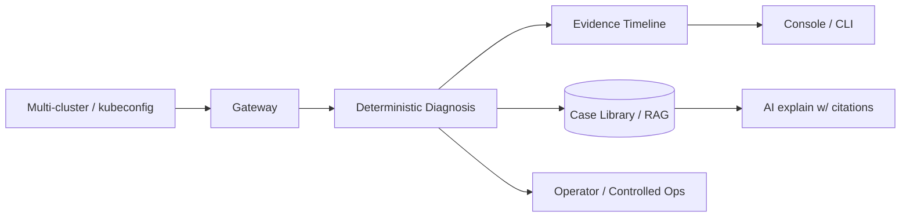

# aiops-platform — English README skeleton (v1, for P2b)

> 供 P2b README 重写直接改用：英文做主、中文附后。第一屏 30 秒看懂。

---

## 1. 首屏（第一屏必须是它）

```markdown
# AIOps Platform

**Kubernetes fault diagnosis with case memory.** Deterministic rule-based root-cause
diagnosis, auto-distilled into a searchable case library — so the next time the same
failure happens, you (or your AI) recall the past fix in seconds.


```bash
# Try it in one line (CLI, no cluster web stack needed)
go install github.com/guiyi-labs/aiops-platform/cmd/aiops@latest
aiops diagnose --kubeconfig ~/.kube/config
```

`Multi-cluster · Diagnostic-first · Audit-driven · AI-assisted (with citations)`

[](...) [](...) [](#) [](...) [](...)
```

## 2. 核心能力矩阵（一屏内，四象限）

| 诊断 | 记忆 |
|---|---|
| 确定性规则诊断（多信号关联：metrics/logs/events）| 每个 resolved 诊断自动蒸馏入库 |
| 证据时间线（finding → evidence → assessment）| 历史相似案例检索（两阶段：B-tree + 可选 LLM 精排）|
| AI 解释（引用可校验，`historical:N` 证据）| 下次同故障秒回过去怎么修的 |

| 受控运维 | 平台 |
|---|---|
| dry-run → 确认 → 幂等 → 审计 | 多集群 Federation / 全局搜索 |
| Operator/CRD（ControlledOperation）| 多租户 2D 授权（cluster+ns）|

## 3. 快速上手（Quickstart）

```bash
# Option A — CLI (recommended for trying out)
go install github.com/guiyi-labs/aiops-platform/cmd/aiops@latest
aiops diagnose

# Option B — Full web platform (docker compose)
git clone https://github.com/guiyi-labs/aiops-platform
cd aiops-platform
docker compose up -d
# UI: http://localhost:8088
```

## 4. 架构（Mermaid，第二屏）



## 5. 工程指标（徽章行 + 数字）

- Coverage ≥ 70% (core packages ≥ 75%) · linters 0 issues · gosec/trivy clean
- e2e 76/76 · CI: gofmt → lint → coverage → race → Playwright → Gate B

## 6. 文件组织（其余章节）

- 完整功能清单 → `docs/`（不再挤首页）
- 演示剧本 → `docs/demo-rag-diagnosis.md`
- 安全边界 → `SECURITY.md`
- LICENSE: 附上（当前仓库已有 LICENSE）

## 7. 语言策略

- **英文为主**（README 正文、CLI 输出、issue 模板）
- 中文只保留：`README.zh-CN.md` 副本（可选）
- 仓库描述（Description 一行）用英文：`Kubernetes AIOps: deterministic fault diagnosis + case memory (RAG), audit-driven ops`