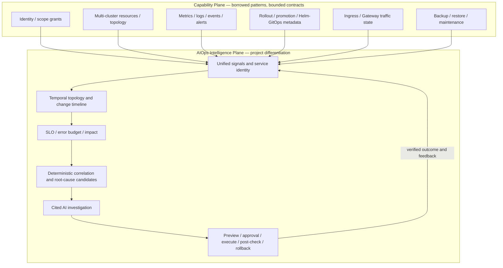
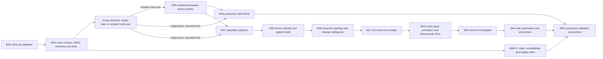

# Post-M32 KubeSphere-Informed Optimization Plan

- Status: M33-M38 and M36 development complete; next targets M37 or M39
- Created: 2026-07-31
- Repository baseline: `main` at `ffc996a615aa3003a6cdf4909efd1fba7c6d4d00`
- Baseline tag: `baseline-m32-20260731`
- Default next milestone: M37 capability adapters or M39 AIOps signal model
- Planned product closure: M45 production validation and new baseline
- Audience: development Agent, reviewer and release owner

本文是 M32 本地归档之后的权威优化执行方案。它参考本机
`C:\BS\kubesphere-master` 中的 KubeSphere 源码快照，但不追求 KubeSphere
功能数量对等。当前项目继续定位为“面向中小规模 Kubernetes 环境的多集群
AIOps 与受控运维平台”，而不是通用 PaaS、应用商店或 DevOps 平台。

较早的 `next-development-plan.md`、`roadmap.md` 中 M26-M32 执行段落和
`references/final-product-gap-analysis.md` 保留为历史决策记录。新开发 Agent
必须从本文读取当前顺序、范围与验收标准。

路线分为三段：M33-M38 建设可信 Capability Plane 和交付底座；M39-M44 建设本项目
差异化的 AIOps 信号、证据、SLO、诊断、AI 和安全自动化闭环；M45 完成生产验证与新基线归档。

## 1. Evidence Boundary

### 1.1 KubeSphere reference

本机 KubeSphere 材料是一个没有 `.git` 元数据的源码快照，因此不能声称它与
远端最新 `master` 完全一致：

- `C:\BS\kubesphere-master\README.md` 声明 KubeSphere v4.1.2；
- `C:\BS\kubesphere-master\go.mod` 使用 Go 1.24.3 和 Kubernetes v0.33.1；
- 根仓库包含后端、CRD、Helm Chart、测试和扩展相关源码，但不包含可进行同等级
  源码审计的完整 Console 前端；
- README 中 DevOps、可观测、Service Mesh、App Store、边缘与 GPU 等能力主要是
  产品或扩展声明，不能等同于本快照中已复现的运行时证据。

可以从源码采纳架构和工程模式，但不能把 KubeSphere 的功能声明直接写成当前项目
缺陷，也不能复制其中与本项目安全边界冲突的实现。

### 1.2 Current platform evidence

当前项目以 M32 本地归档、源码、OpenAPI、迁移、测试和脱敏真实环境证据为准：

- `docs/changes/2026-07-31-final-baseline-archive.md`；
- `docs/changes/2026-07-30-m32-formal-closure.md`；
- `docs/testing/test-matrix.md`；
- `.artifacts/verification/verify-20260731-015255.json`；
- M27-M31 一次性 kind/Velero/MinIO 验收证据。

未执行的生产 OIDC/MFA、物理/WAL PITR、HA 和归档 revision hosted release
不能标记为通过。

## 2. Comparison Summary

| Area | KubeSphere reference pattern | Current M32 state | Decision |
|---|---|---|---|
| Kubernetes client | `client-go`、typed/runtime client、RESTMapper、按集群缓存 | 自建 HTTP GET/PATCH/POST registry | M33 必须迁移受控写路径和客户端生命周期 |
| Request contract | 统一 RequestInfo 驱动认证、授权、审计和路由 | 已有 request context，但 route、role、audit action 仍分散维护 | M34 建立固定 RouteDescriptor |
| Authorization scope | Global/Cluster/Workspace/Namespace 多层授权 | 四个全局平台角色，默认缺少集群/Namespace 范围 | M35 以轻量 grant 补齐；不照搬完整 Workspace |
| Identity | OIDC/LDAP/GitHub/CAS 等 provider factory | 本地账号完整，OIDC/MFA 只有离线准入 | M36 只实现一个组织批准的 OIDC provider |
| Observability | 监控、集中日志、告警通知作为扩展 | 指标历史、告警生命周期完善；日志仅 Pod 直读，通知缺路由/静默 | M37 建能力 adapter，M39-M42 转换为信号、SLO 和诊断价值 |
| Gateway | Ingress/Gateway API、拓扑与网关指标 | Ingress 详情/诊断/推广已实现，无 Gateway API | M37 只读接入，作为拓扑、SLO 和影响证据 |
| Delivery | Helm、升级 hooks、离线安装 | Compose/Kustomize 安全基线完整，无正式 Helm 升级链路 | M38B 增加 Helm、版本矩阵和升级回滚演练 |
| Supply chain | 独立安全政策、版本变更与扩展约束 | SHA256 和依赖许可已有，无 SBOM/签名/provenance/EOL | M38C 补齐发布治理 |
| Extension model | 微内核、APIService、JSBundle、ReverseProxy | 模块化单体和静态 OpenAPI | 仅按需采用编译期 provider，不允许动态代码和任意代理 |
| Multi-tenancy/DevOps/App Store | KubeSphere 核心产品方向 | 当前明确不是通用容器平台 | 不进入默认路线；必须重新做产品决策 |

## Target Product Architecture: KubeSphere Foundation + AIOps Core

KubeSphere 类能力在本项目中是 **Capability Plane**，负责安全、受限地提供集群、资源、身份、
观测、交付、网关与保护信息。项目的差异化是 **AIOps Intelligence Plane**：把这些能力转换为
可追溯信号和证据，再完成确定性关联、引用式 AI 调查和人工确认的安全闭环。



The single product workflow is:

```text
signal collection
  -> evidence normalization
  -> topology/time/change correlation
  -> deterministic diagnosis and impact
  -> cited AI investigation
  -> fixed runbook preview
  -> human approval and idempotent execution
  -> post-action verification
  -> effective / ineffective / failed / unknown feedback
```

### Capability-to-AIOps mapping

| Foundation capability | Existing or planned source | AIOps consumer | Product value |
|---|---|---|---|
| Multi-cluster and scope | fleet, search, M35 grants | authorized signal envelope and blast radius | one incident never leaks or merges hidden scope |
| Resource inventory | typed Kubernetes reads | stable service identity and topology edges | symptoms are attached to exact UID and dependency path |
| Metrics/events/logs | M21/M27, Kubernetes Event, M37 providers | freshness-aware evidence and SLO | missing data is explicit rather than fabricated healthy state |
| Rollout/promotion | M23/M24 operations and audit | high-confidence change candidates | diagnosis can distinguish recent reviewed change from coincidence |
| Gateway/Ingress | Ingress and optional Gateway API | request availability, latency and route impact | service-level impact rather than only Pod health |
| Backup/restore/maintenance | M28/M30/M31 plans | risk context and eligible runbooks | remediation checks protection and disruption prerequisites |
| Helm/GitOps metadata | optional read-only adapters | external change timeline | delivery changes become evidence without building a pipeline engine |
| Identity/audit | current roles, M35/M36, signed audit | safe investigation and approval attribution | AI context and operations retain least privilege and accountability |

### Product information architecture

The UI is split into two layers. KubeSphere-style resource management is supporting navigation, not the home page.

**Platform management**:

- clusters and Kubernetes resources;
- users, roles and access scopes;
- provider/capability health;
- audit, delivery and system configuration.

**AIOps center**:

- health, services and SLOs;
- signals, alerts and diagnosis cases;
- topology and change timeline;
- evidence-backed AI investigation;
- runbook plans, approvals and post-checks;
- quality/evaluation reports.

Every supported resource detail provides an “Analyze” deep link carrying exact cluster, Namespace, kind, UID/name and
time range. It must not create a second unbounded resource editor.

### AIOps invariants

- Deterministic evidence and rules remain the source of truth; AI cannot modify them.
- A temporal relationship is a candidate, not proof of causality.
- Every confirmed fact and AI claim cites an authorized evidence ID.
- Logs, Events, labels, annotations and manifests are untrusted model input and are prompt-injection tested.
- AI may rank only server-approved runbooks; it cannot create Kubernetes commands, patches, URLs or query languages.
- AI never approves or executes. The default automation ceiling is L2: human-confirmed execution.
- Incomplete, stale, conflicting or unavailable evidence must produce `partial` or `unknown`, never false health or cause.
- A provider outage cannot break identity, resource reads, deterministic diagnosis, audit or manual operations.

## 3. Decisions: Adopt, Adapt, Reject

### 3.1 Adopt or adapt

1. 使用官方 Kubernetes 客户端、typed fake client 和稳定的集群客户端生命周期。
2. 用一个不可变 RouteDescriptor 统一路由、认证、授权、审计、请求上下文和低基数指标。
3. 保留显式 `cluster_id`，增加轻量集群/Namespace grant，不引入完整 Workspace CRD。
4. 身份提供方只做编译期固定接口，生产 V1 只接一个组织批准的 OIDC provider。
5. 可观测、日志、通知和备份等外部能力使用 typed provider 与 capability 状态，失败局部隔离。
6. 保留 Kustomize，同时提供 Helm、离线产物、升级检查、版本兼容和回滚证据。
7. 增加 SECURITY/EOL、CHANGELOG、SBOM、签名、provenance 和同 revision 发布门禁。

### 3.2 Explicitly reject

- 任意 Kubernetes URL、HTTP 方法、GVR、GVK、YAML CRUD 或透明 API 代理；
- 动态 APIService、任意 ReverseProxy、远程 JSBundle 和未签名进程内插件；
- Pod exec/WebShell、容器文件上传下载、任意 Pod 删除、force drain 或 PDB bypass；
- 浏览器 Secret/仓库口令管理和请求/响应体审计；
- 默认引入 Workspace 全套多租户、Jenkins、Argo CD 控制面、App Store、Service Mesh、
  KubeEdge、GPU 调度、CSI/OpenELB；
- 将本地逻辑恢复或隔离 Namespace restore 描述为生产 PITR/HA/灾备。

## 4. Known Baseline Gaps To Close First

### 4.1 Client contract debt

`docs/adr/0004-bounded-read-only-kubernetes-gateway.md` 明确要求在进入写操作前接入
`client-go` 和 fake client 测试，但当前 `backend/internal/cluster/registry.go` 仍通过
原始 HTTP 执行 GET/PATCH/POST，M23-M31 已在此基础上增加多条写路径。该问题是
M33 的 P0 技术债，不得继续向原始 gateway 增加新写操作。

### 4.2 RBAC resource contract debt

ADR 0039 承诺 Role、ClusterRole、RoleBinding 和 ClusterRoleBinding 固定只读合同，
当前 Gin 路由、OpenAPI、前端和 managed-cluster observer RBAC 尚未实现。M34 必须补齐
或通过新 ADR 明确撤销；默认决策是补齐。

### 4.3 Documentation truth debt

README 仍写 17 类资源和早期四种操作，架构/API 文档仍称 Deployment rollback 未实现，
旧计划仍指示 Agent 从 M27 开始，截图仍绑定 `uncommitted-baseline`。M34 必须把
源码、OpenAPI、架构图、状态页、计划和截图重新绑定到真实 revision。

### 4.4 Remote verification debt

托管 real-kind workflow 只覆盖 diagnosis/fleet/search/M21，没有纳入 M23-M31；Linux
race 未运行；发布只生成 linux/amd64 且没有 SBOM、镜像签名或 provenance。这些进入
M38，不得在 M33-M37 的完成声明中暗示已经解决。

## 5. Execution Order And Gates



Execution rules:

1. M33 and M34 are mandatory and serial.
2. M35 is mandatory for multi-team or customer-isolated deployment. A single global operations team may mark it
   `not applicable`, but only through an ADR that records owner, reason and re-entry condition.
3. M36 and M45 depend on organization/provider infrastructure and may be locally implemented but externally deferred.
4. M37A-M37D are separate capability reviews; optional adapters must not block the native M39 signal path.
5. M38 may proceed after M34 in parallel with product work, but release policy changes require explicit authorization.
6. M39-M44 are the AIOps differentiation route and are serial by default. Each phase must reuse accepted prior evidence
   rather than introduce a second alert, diagnosis, workflow or authorization system.
7. Static module registration remains an engineering decision gate and starts only after at least two providers create
   demonstrated lifecycle pain.
8. A new baseline tag is allowed only after the selected milestone, full gates, real-environment evidence and docs are complete.

## 6. Non-Negotiable Development Requirements

### 6.1 Architecture and scope

- Every milestone starts with an ADR or an accepted ADR update before production code.
- Handler DTOs and domain interfaces remain independent of `client-go` concrete types.
- No new public API accepts a Kubernetes path, method, GVR/GVK, raw patch, raw manifest, provider query language or credential.
- External dependencies are optional capabilities. Their outage must not make unrelated health/read paths fail.
- Bounded concurrency, timeout, result count, byte size, retention and cleanup values must be explicit and tested.

### 6.2 Public contract

- Gin route, RouteDescriptor, OpenAPI, frontend client/types, authorization and audit metadata must agree bidirectionally.
- New errors require stable machine code, sanitized message and documented HTTP status.
- Breaking API/schema changes require a new version, deprecation period, migration note and explicit ADR.
- Empty collections serialize as arrays; partial/truncated/unavailable states cannot be labeled healthy or complete.

### 6.3 Data and concurrency

- Every new table has paired up/down migration, FK/unique/index review and PostgreSQL integration coverage.
- Claims, confirmation tokens, idempotency keys and stale resource preconditions retain current semantics.
- Multi-instance workers use database locking/claims or leader election; process memory is not a correctness boundary.
- Credential or grant changes must take effect on the next request and invalidate relevant caches safely.

### 6.4 Security

- Target-cluster RBAC adds only reviewed resources and exact verbs; negative verb tests are mandatory.
- Secret values, kubeconfig, tokens, certificates, client secrets and provider credentials never enter API, UI, logs,
  audit, evidence or Git.
- Audit continues to record safe metadata only. Preview/dry-run remains auditable.
- SSRF controls require server-configured HTTPS destinations, DNS/IP policy, redirect rejection, timeout and response caps.
- Browser visibility is not authorization; every scope decision is enforced server-side.

### 6.5 Frontend and evidence

- New routes require typed API tests, component/state tests, loading/empty/partial/error states and deep-link checks.
- Browser acceptance is required at 390x844 and 1280x720 with no body overflow or warning/error logs.
- Real-environment scripts are disposable by default and write sanitized JSON evidence containing revision, dependency
  versions, result and cleanup assertions.
- No skipped or unavailable check may be reported as passed.

## 7. M33 - Restricted client-go Migration ✅

### 7.1 Goal

Replace the raw mutation gateway with an official, bounded Kubernetes client layer while preserving every fixed API,
redaction, precondition, timeout, size and least-privilege invariant accepted through M32.

### 7.2 Required implementation

1. Add `k8s.io/client-go` and `k8s.io/api` at exactly the same v0.34.x version as `k8s.io/apimachinery`.
2. Introduce a `ClusterClientProvider` that caches:
   - sanitized `rest.Config`;
   - typed clientset;
   - dynamic client only for server-fixed CRD GVRs;
   - discovery client, transport and server version.
3. Cache identity includes `cluster_id` and credential generation/digest. Concurrent first use builds one client only.
4. Credential rotation, cluster disable and deletion invalidate after successful database commit, close idle connections
   and prevent new requests from obtaining the old generation.
5. Keep the strict kubeconfig parser: no local file references, `exec`, external auth-provider or non-HTTPS API endpoint.
6. Configure fixed QPS, Burst, timeout, User-Agent, response cap and per-cluster concurrency.
7. Migration order:
   - Deployment/CronJob/Node patch and policy/v1 eviction;
   - fixed Service/Ingress/Deployment promotion create/update;
   - fixed Velero Backup/Restore CRD operations;
   - Pod logs and discovery;
   - standard read-only resources.
8. Standard resources use typed clients. Velero and optional Gateway API use dynamic clients with code-owned GVRs.
9. Delete or make unreachable the public raw `Registry.Patch/Create` surface after migration.

### 7.3 Acceptance standard

- `go.mod` client-go/api/apimachinery versions are identical.
- No production controlled write path calls raw `Registry.Patch`, `Registry.Create` or constructs an arbitrary URL.
- Typed and dynamic fake clients cover success, 403, 404, conflict, timeout, stale UID/resourceVersion and dry-run.
- 100 concurrent requests for one cluster/generation build one reusable client; race testing reports no data race.
- Successful credential rotation makes the old client unavailable to all later requests; failed rotation leaves the old
  client usable.
- Existing request/response DTO and OpenAPI contracts do not change accidentally.
- Managed-cluster RBAC allowlist is byte-for-byte unchanged unless a separately reviewed resource is required.
- M23-M31 disposable real-kind suites pass against the new client layer and clean all resources.
- Linux `go test -race -count=1 ./...` passes; if no Linux/gcc runner is available, M33 remains externally blocked rather
  than accepted.

### 7.4 Non-goals

- No informer/watch cache for all Kubernetes objects.
- No RESTMapper-driven arbitrary resource access.
- No generic dynamic client API exposed above the infrastructure package.

## 8. M34 - Unified Route Contract, RBAC Inventory And Documentation Truth ✅

### 8.1 M34A RouteDescriptor

Introduce an immutable descriptor containing at least:

```text
method, pathTemplate, operationID, public/protected, allowedRoles,
scope, resourceType, auditAction, auditRequired, sensitiveResponse
```

The same descriptor drives route registration, authentication, role checks, request context, audit classification and
low-cardinality metrics. It does not reproduce Kubernetes API machinery; supported scopes are only Global, Cluster and
Namespace.

Acceptance:

- Gin routes, OpenAPI and RouteDescriptor are bidirectionally equal.
- Public health/metrics/auth routes are explicitly marked; all unclassified routes fail closed.
- Duplicate method/path or operationID and missing write/export audit action fail startup or contract tests.
- Cluster, Namespace, resource and action are parsed once and agree in authorization, audit and logs.
- 401/403/404/409/5xx audit outcomes and request IDs have table-driven tests.
- Audit still never reads request or response bodies.

### 8.2 M34B Kubernetes RBAC inventory

Add fixed read-only list contracts for:

- Role;
- ClusterRole;
- RoleBinding;
- ClusterRoleBinding.

Public projections may include safe metadata, Role rules and Binding subjects/roleRef. They must never resolve
ServiceAccount tokens, Secret values or impersonate a subject. Namespaced lists accept only an exact optional Namespace;
cluster-scoped lists reject Namespace ambiguity.

Acceptance:

- Gin, OpenAPI, backend DTO, frontend client/type and an “Access” inventory UI are aligned.
- Pagination, stable sorting, exact Namespace filtering, empty arrays and max response bounds match existing resources.
- Managed observer RBAC adds only `get/list` for reviewed `rbac.authorization.k8s.io` resources; `watch` requires explicit
  evidence, and create/update/patch/delete/bind/escalate/impersonate remain denied.
- A disposable kind fixture proves all four resource classes, safe projection, cross-Namespace isolation and cleanup.
- Desktop/mobile UI passes without exposing token or Secret material.

### 8.3 M34C Documentation and presentation baseline

Update README, architecture overview, API guide, system diagrams, docs index, roadmap status and screenshots so they
describe M21-M34 truth. Mark the old M26-M32 execution plan and post-M25 gap analysis as superseded history.

Acceptance:

- README reports the actual resource/action set and links the current plan.
- Architecture/API docs no longer say exact Deployment rollback is deferred.
- No current document tells a new Agent to start M27.
- Current screenshots include the principal M27-M34 surfaces and bind to an actual Git revision.
- Markdown links, code snippets and version/status consistency checks pass.

## 9. M35 - Lightweight Cluster And Namespace Access Grants ✅

### 9.1 Decision gate

M35 is required when more than one operations/customer team shares the platform. If deployment is permanently limited
to one trusted global operations team, an ADR may mark M35 not applicable with owner, reason and re-entry condition.

### 9.2 Fixed V1 scope

- Keep the four existing platform roles as the action dimension.
- Add user-to-cluster grants and optional exact Namespace grants as the resource-scope dimension.
- Do not add user-defined policy languages, Rego, group nesting or Workspace CRDs in V1.
- SystemAdmin remains global.
- OperationsAdmin and Viewer see only granted clusters/Namespaces.
- SecurityAuditor keeps platform security/audit visibility but receives no Kubernetes mutation permission.
- Lists, details, logs, metrics, diagnoses, alerts, backups, restore/maintenance/promotion plans, fleet and global search
  all use the same policy evaluator.

### 9.3 Acceptance standard

- Migrations contain FK, unique constraints, indexes and up/down coverage.
- Two users × two clusters × three Namespaces cover allowed and denied read/write/search/export paths.
- An unauthorized target is absent from lists/fan-out and cannot be distinguished through direct IDs or error details.
- Grant revocation takes effect on the next request even with an existing access token.
- Grant changes and denied attempts are audited without leaking hidden cluster/resource names.
- Fleet/search completeness is calculated over authorized scope, not over hidden clusters.
- Real two-kind E2E proves cluster and Namespace isolation and full cleanup.

## 10. M36 - Production OIDC And MFA ✅

### 10.1 Scope

Implement one organization-approved OIDC provider behind a small compiled interface. Reuse the accepted offline
identity-readiness policy, but do not add LDAP, CAS, GitHub, IDaaS or a runtime provider marketplace by default.

Requirements:

- Authorization Code + PKCE S256, state, nonce, issuer, audience and HTTPS discovery validation;
- bounded JWKS cache and rotation;
- immutable subject mapping and fixed claim/group-to-role allowlist;
- required MFA evidence for privileged roles;
- current-user status, role/grant version and session revocation checked on every protected request;
- local break-glass account retained with high-priority audit/notification and operational rotation policy;
- provider secret supplied by external Secret/configuration, never browser-managed.

Acceptance:

- Valid issuer/audience/nonce/state/PKCE/MFA succeeds.
- Wrong issuer/audience/state/nonce, expired token, unknown key, disallowed algorithm, missing MFA and unauthorized role
  claim fail closed.
- JWKS rotation works without restart and retired keys stop validating.
- OIDC user disable, role removal, grant removal and logout take effect on the next request.
- Provider logout and local session cleanup are tested.
- A real organization IdP run is required for production acceptance; a synthetic IdP only accepts local implementation.

## 11. M37 - Capability Plane Adapters

M37 brings selected KubeSphere-style platform functions into bounded provider contracts. These adapters are evidence
sources for later AIOps phases; they are not separate product centers and must not delay the native M21-M31 signal path.

### 11.1 M37A Metrics and historical log providers

Introduce compiled `MetricsProvider` and `LogProvider` interfaces. Existing Metrics API/PostgreSQL history remains the
infrastructure default. V1 adds one Prometheus-compatible metrics adapter for fixed service SLI templates and one
read-only historical log adapter selected by ADR (default recommendation: Loki).

Public APIs accept fixed template/query AST fields only: authorized service/resource, exact optional cluster/Namespace/
Pod/container, bounded text, start/end, direction and limit. They never accept PromQL, LogQL, OpenSearch DSL, arbitrary
labels or provider URLs.

Acceptance:

- Provider endpoints and credentials are server-configured; request input cannot redirect a query.
- Logs default to 1 hour, hard-stop at 7 days and enforce timeout, concurrency, result, byte and export bounds.
- Metrics expose template/version, sample coverage, missing-data policy and freshness.
- Disposable provider fixtures prove two clusters/Namespaces, ordering, pagination, partial failure, special characters,
  counter reset, sparse points and long-line truncation.
- Provider outage affects only its capability and returns explicit `partial`/`unavailable` state.
- Credentials and provider internals never enter API, audit, logs, evidence or Git.

### 11.2 M37B Alert routing and bounded silences

Build on the existing M27 lifecycle and transactional outbox. V1 supports exact-match route priority and an HTTPS
webhook receiver; email/chat channels require independent adapters and evidence.

Requirements and acceptance:

- persist route priority, exact cluster/rule/severity match, dedupe key, group/repeat interval and delivery timeline;
- require silence reason, creator, start/end and a hard maximum duration; permanent silence is forbidden;
- store receiver credentials as encrypted backend references and return metadata only;
- enforce HTTPS, redirect rejection, DNS/IP SSRF policy, timeout, capped response and sanitized error;
- disposable TLS receiver proves firing, delivered, retry/dead, resolved, dedupe, silence and expiry;
- duplicate workers and restart produce one business delivery per dedupe contract;
- M35 scope isolation applies to route, receiver, silence and delivery data.

### 11.3 M37C Gateway and Ingress evidence adapter (optional)

Add fixed read-only GatewayClass, Gateway, HTTPRoute and ReferenceGrant inventory using code-owned GVRs, plus
Accepted/ResolvedRefs/Programmed conditions, addresses and route-to-Service/EndpointSlice/Pod topology. A reviewed
metrics template may add request success and latency evidence.

Acceptance:

- capability detection distinguishes absent CRDs, forbidden access and healthy empty results;
- fixed-version kind fixture proves conditions, reference resolution, topology and partial failure;
- V1 grants read verbs only and contains no controller install, Helm values or Gateway mutation path;
- unsupported implementations stay explicit rather than guessed healthy.

### 11.4 M37D Delivery metadata adapters (optional)

Add read-only Helm release and one GitOps/CI status adapter only when change correlation needs external delivery context.
Persist safe revision, chart/version/digest, commit, image digest, target and status metadata; never accept repository
write credentials, raw Helm values or pipeline execution.

Acceptance:

- commit/image/release association uses immutable digest/revision rather than mutable tag alone;
- a provider failure is locally isolated and stale status is disclosed;
- hidden projects and clusters are absent from API, counts and later AI context;
- the adapter grants no repository write, pipeline execute or cluster mutation permission.

## 12. M38 - Engineering, Delivery And Supply-Chain Hardening ✅

### 12.1 M38A Hosted CI completeness

- Add M23-M31 to `real-kind-e2e.yml`; PRs run affected suites and scheduled/manual runs execute the full matrix.
- Require Linux race, Go/frontend lint, coverage baseline, generated-artifact clean-tree and OpenAPI breaking-change checks.
- Missing expected evidence fails rather than warns.
- A release may proceed only when regular CI and real-kind evidence succeed for the same Git SHA.

Acceptance:

- `go test -race -count=1 ./...` passes on Linux/gcc.
- Security-critical auth, grant, credential, operation, backup and restore packages meet an agreed package threshold
  (recommended 80%); repository coverage cannot fall below the first recorded baseline.
- Every M23-M31 suite emits revision/dependency/status/cleanup JSON and leaves no cluster, registration, container,
  network, kubeconfig or credential residue.
- Branch protection, reviewer requirement and force-push policy are recorded and enabled when repository capabilities
  permit; otherwise owner/reason/re-entry is explicit.

### 12.2 M38B Helm, upgrade and support matrix

Keep Kustomize and add one official Helm Chart with `values.schema.json`. V1 covers external PostgreSQL production mode,
development PostgreSQL mode, existing Secret, Ingress/TLS, pinned image tag/digest, resources, scheduling, NetworkPolicy,
PDB and replica settings. No production default credential is generated or printed.

Acceptance:

- `helm lint --strict` passes;
- default, external-database, existing-Secret and HA values render and pass strict schema validation;
- fresh install succeeds on Kubernetes 1.33 and 1.34, or the accepted N/N-1 matrix current at implementation time;
- previous release → current upgrade → data/API/UI verification → Helm rollback is exercised in disposable clusters;
- unsupported Kubernetes/Velero/Metrics Server/PostgreSQL versions fail preflight with a stable reason;
- Chart, app, image, OpenAPI, docs and release metadata versions are consistent.

### 12.3 M38C Security and release supply chain

- Add root `SECURITY.md`, supported/EOL table, private reporting route, response targets, `CHANGELOG.md` and ownership rules.
- Produce linux/amd64 and linux/arm64 images, SPDX or CycloneDX SBOM, vulnerability/configuration scans, signed images,
  signed release assets and SLSA-style provenance.
- Upgrade dependency-license output to an enforceable allowlist.
- Parameterize broad Kubernetes API egress; retain default-deny NetworkPolicy and restricted pod security.

Acceptance:

- Release contains multi-arch manifest, SBOM, signature, provenance and SHA256 bound to one immutable digest.
- `cosign verify`, SBOM checksum and provenance subject validation pass.
- Critical vulnerabilities are zero; High exceptions include owner, expiry and approved rationale.
- Unknown or disallowed licenses fail the release.
- Secret scan, Pod Security Restricted, least-privilege RBAC and NetworkPolicy checks pass.

### 12.4 M38D Engineering generation/lifecycle backlog

OpenAPI-generated TypeScript DTO/client code is recommended once RouteDescriptor stabilizes. A static module/provider
registry is allowed only after at least two providers demonstrate lifecycle pain. It may expose Name, route registration,
Start, Stop, Health and dependencies, while remaining compiled into one release.

Acceptance when activated:

- two generation runs produce no second diff and RouteDescriptor/Gin/OpenAPI/generated client agree;
- duplicate modules, missing/cyclic dependencies and invalid configuration fail startup;
- disabled modules register no route and start no goroutine;
- optional provider failure does not fail core liveness and shutdown is bounded;
- no runtime code download, JS injection, arbitrary proxy or unsigned Go plugin exists.

## 13. M39 - Unified Service Identity And Signal Model

M39 begins the AIOps differentiation route. It normalizes existing M21-M31 outputs before adding more algorithms.

### 13.1 Bounded service identity

V1 does not create a general CMDB. A service identity is derived from exact observed relationships among cluster,
Namespace, Service, supported workload controller, Ingress/Gateway, EndpointSlice and Pod. The primary resource key is
`cluster_id + kind + UID`; a name-only fallback is explicitly incomplete and short-lived.

### 13.2 Signal contract

Define a compiled `SignalDescriptor` catalog containing code, domain, schema version, severity policy, correlation
dimensions, required evidence, allowed action codes and retention. Unregistered signals fail closed.

The normalized envelope contains at least:

```text
signal_id / signal_code / schema_version / producer
cluster_id / namespace / primary entity UID
observed_at / window_start / window_end / ingested_at
severity / state / fingerprint
coverage / freshness / complete|partial|unavailable|truncated
safe attributes / evidence refs / expires_at / ingestion_run_id
```

First adapters normalize existing metric breaches, Kubernetes Events, alert transitions, deterministic diagnosis hits,
M29 governance findings and M23-M31 change/action outcomes. PostgreSQL stores bounded indexes and evidence snapshots,
not full Prometheus series or log archives.

Recommended persistence:

- append-only, TTL-bound `signal_occurrences` with unique fingerprint/window semantics;
- stable public evidence IDs and content hashes on bounded/redacted `diagnosis_evidence`;
- no raw telemetry warehouse, full manifest or complete log body.

### 13.3 API and acceptance

Add a bounded `GET /api/v1/aiops/overview` with source completeness, active diagnoses, top signals, recent changes and
action outcomes. It uses RouteDescriptor and M35 scope when active.

Acceptance:

- duplicate/concurrent/restarted producer delivery yields one stable occurrence per fingerprint contract;
- late, out-of-order, clock-skewed and expired signals have deterministic behavior;
- hidden cluster/Namespace data never enters results, counts, errors or evidence references;
- provider failure remains source-local and incomplete evidence cannot appear healthy;
- retention cleanup, pagination, query window, row/byte/concurrency limits and restart durability pass PostgreSQL tests;
- native M21-M31 signals work even when every optional M37 provider is disabled.

## 14. M40 - Temporal Topology And Change Intelligence

### 14.1 Time-valid topology

Persist only reviewed relationship edges, not full Kubernetes objects:

- `Owns`, `Selects`, `RoutesTo`, `BackedBy`, `RunsOn`, `Mounts`, `Scales`, `ProtectedBy`.

Each edge records source, exact endpoint identities, derivation method, first/last observation and validity interval.
OwnerReference, selector, EndpointSlice and backend evidence remain distinct; same-name or temporal proximity never creates
an edge.

### 14.2 Change timeline

Normalize platform operations, rollout, promotion, maintenance, backup/restore and optional delivery adapter status into
safe change references containing target UID, action, typed safe diff/hash, revision/digest, actor snapshot, start/end,
result, plan ID, audit ID and request ID. Secret values and full manifests are excluded.

Platform-controlled changes are high-confidence observations. Kubernetes Events or external delivery adapters are lower-
confidence context until exact identity and result are verified.

### 14.3 API and acceptance

Add bounded diagnosis timeline and evidence-graph APIs. Nodes/edges disclose source completeness, truncation and remaining
counts and are filtered before aggregation by authorization scope.

Acceptance:

- kind fixtures reconstruct `Ingress/Gateway → Service → EndpointSlice → Pod → ReplicaSet → Deployment` exactly;
- selector changes, Pod recreation and rollout end old edges and create new valid edges;
- historical queries return only edges valid at the requested time;
- unrelated Namespace/name collisions and unsupported relations never create edges;
- timeline links M23-M31 plan/audit/request identities and reports missing/forbidden/partial sources separately;
- graph/time/node/edge/byte limits and cleanup retention are deterministic.

## 15. M41 - SLO, Error Budget And Impact

M41 converts provider metrics and topology into user-visible service impact. V1 supports server-owned SLI templates only:

- request success ratio;
- request latency target ratio;
- workload readiness as an explicitly labeled platform-health indicator, never a substitute for request availability.

An SLO stores authorized service/scope, template and version, objective, rolling window, missing-data policy, owner, fast/
slow burn settings and enabled state. The API never accepts raw PromQL.

Acceptance:

- deterministic series prove good/total events, target, remaining budget and burn-rate calculation;
- counter reset, sparse data, clock boundaries and provider timeout never fabricate normal health;
- fast and slow burn alerts fire, dedupe, recover and enter the existing M27 lifecycle;
- SLO edits are versioned/audited and do not rewrite historical evaluations;
- SLO views link authorized signals, changes, topology and diagnoses;
- detection latency stays within documented scrape/evaluation/jitter bounds;
- unsupported/missing traffic metrics remain `unavailable`; readiness alone cannot satisfy a request SLO.

## 16. M42 - Multi-Signal Correlation And Deterministic RCA

M42 uses versioned, replayable rules. It does not introduce a black-box anomaly score or a second incident workflow.
`diagnosis_records` remains the human status, assignment, SLA, feedback and audit source of truth.

Recommended additions:

- `diagnosis_signal_links` with trigger/context/change/outcome relation;
- `diagnosis_resource_links` with exact topology path;
- `diagnosis_change_candidates` with correlation rule, factors, confidence class and evidence/contradiction refs;
- diagnosis `case_key`, correlation version, first/last observed time and evidence completeness.

Correlation factors are explicit: same UID, topology distance, bounded time distance, reviewed change-symptom rule,
signal freshness/completeness and deterministic diagnosis match. Temporal proximity alone is never causality. Conflicting
or insufficient evidence must yield `unknown` or a candidate, not a confirmed root cause.

APIs add bounded diagnosis timeline, graph and action-candidate views; action candidates contain fixed code, eligibility,
blocked reasons and exact target identity, not an execute endpoint.

Acceptance:

- a versioned golden replay set covers ImagePullBackOff, CrashLoopBackOff, OOMKilled, Pending/PVC Pending, Service without
  endpoints, unavailable Deployment, Node NotReady/Pressure, sustained metric breach and bad rollout;
- N duplicate symptoms form one active case only when deterministic `case_key` matches, while preserving all occurrences;
- different UID, authorization scope or unrelated topology never merges;
- known root changes rank in the expected Top-3 and exact reviewed scenarios rank first;
- unrelated simultaneous changes are not asserted as causes;
- cold-start, incomplete and conflicting fixtures produce `unknown` as expected;
- identical evidence/rule/correlation versions reproduce identical factors, reason codes and links;
- AI and optional providers disabled still yield the complete deterministic result.

## 17. M43 - Cited And Evaluated AI Investigator

M43 extends the existing per-diagnosis cited explanation into a case-level investigator. It is not a general chat console.

Structured output contains:

```text
summary / impact
hypotheses[]: claim, confidence, evidence_ids, disconfirming_evidence, next_checks
recommended_runbook_id
uncertainties[]
```

Rules:

- every factual claim, impact statement and hypothesis cites an authorized evidence ID;
- the model cannot upgrade a candidate to confirmed cause or modify alert/diagnosis severity, owner or state;
- only server-fixed read-only tools may be invoked; no Kubernetes URL, kubectl, SQL, PromQL, LogQL or raw provider query;
- logs, Events, labels, annotations and manifests are untrusted data and cannot alter system/tool instructions;
- model recommendations are runbook IDs already declared eligible by the deterministic Action Catalog;
- AI outage, budget exhaustion or schema/citation failure leaves deterministic investigation and manual actions available.

Acceptance:

- the golden set includes correct, insufficient, conflicting, malicious prompt-injection and hidden-scope cases;
- fabricated, nonexistent or unauthorized citations reject the entire output;
- evidence-free factual assertion rate is zero on the accepted golden set;
- hidden scope cannot leak through output, token counts, timing-sensitive summaries or exports;
- fixed model/prompt/rule/evidence versions generate a recorded regression report;
- quality report includes citation validity, unsupported-claim rate, eligible-runbook rate and human feedback;
- model/provider changes cannot merge without golden-set comparison and explicit reviewer disposition.

## 18. M44 - Policy-Constrained Automation And Post-Action Verification

Automation levels are explicit:

- L0 observe only;
- L1 deterministic/AI-assisted recommendation;
- L2 human-confirmed execution;
- L3 pre-authorized automatic execution.

The default product closure is L2. L3 requires a separate ADR, shadow mode, narrow policy, canary, kill switch and user
approval; it is not implied by completing AI integration.

M44 reuses existing fixed preview/confirmation/idempotency/audit paths. It adds deterministic `ActionCandidate`, optional
source diagnosis links, policy gates and post-action verification. AI output never becomes client input directly.

Before preview/execute, the server rechecks UID/resourceVersion, M35 scope, PDB/replica/blast radius, active SLO and error
budget, maintenance/freeze window, required backup/rollback point, concurrent plans, attempt cap and timeout.

After execution, the server repeats the same resource/SLI evidence window. Public outcome is `effective`, `ineffective`,
`failed` or `unknown`; the evidence comparison records `improved`, `unchanged`, `worse` or `insufficient`. Missing evidence
never resolves a diagnosis automatically.

Acceptance:

- stale UID/RV, expired token, duplicate execution, wrong target, unauthorized scope and unconfirmed plan fail closed;
- two workers and replay produce one business side effect;
- high-risk actions support four-eyes approval and requester cannot self-approve;
- pre/post checks use the same versioned SLI/resource rules and preserve evidence;
- a failed post-check follows only the server-owned rollback contract; unsafe rollback stops and escalates to a human;
- preview, approval, execute, verify and rollback share correlation/request identities and complete safe audit metadata;
- real kind proves effective, ineffective/unchanged and unknown/insufficient cases;
- action outcome feeds offline quality evaluation but never self-modifies rules, prompts or policy online.

## 19. M45 - Production Validation And New Baseline

M45 closes the optimized product; it is not permission to add more KubeSphere feature categories.

Required production gates:

1. Hosted CI, Linux race and full real-kind matrix on the selected revision.
2. Production OIDC/MFA and break-glass evidence.
3. Backend/frontend multi-replica deployment with PDB, topology spread and rolling-update evidence.
4. External HA PostgreSQL, WAL/PITR, measured RPO/RTO and failover/failback.
5. Multi-instance collectors, correlators, alert scheduler, outbox and operation claims produce no duplicate business effect.
6. Signed multi-arch release, SBOM, provenance, support matrix and upgrade/rollback evidence.
7. A versioned AIOps golden dataset and quality report bound to the release revision.
8. Refreshed architecture, API, screenshots, test matrix and final archive bound to one revision/tag.

The mandatory end-to-end golden scenario is:

1. establish a healthy service and SLO;
2. publish a bad image through an accepted fixed operation;
3. capture rollout change, Pod/Event, metric/SLO and optional log signals;
4. build the exact Ingress/Gateway-to-Deployment impact graph and timeline;
5. rank the reviewed rollout as the first deterministic cause candidate;
6. generate an AI investigation whose claims cite only real evidence and disclose uncertainty;
7. preview and approve an exact revision rollback;
8. execute idempotently and verify resource/SLO recovery;
9. recover the alert, record diagnosis/action outcome and send the accepted notification;
10. clean every cluster, provider credential, fixture and temporary artifact.

Negative companions:

- create an unrelated simultaneous change in another Namespace and prove it is not misattributed;
- stop one metrics/log provider and prove the case is partial/unknown rather than falsely healthy or resolved.

Production acceptance also proves no continuous probe 5xx during Pod/node disruption, database failover preserves all
platform/AIOps records, PITR reaches a chosen point, and every external gate has status, owner, reason and re-entry evidence.
Worktree must be clean, the tag must point to the archive commit and all evidence must be sanitized.

Do not claim an MTTR reduction percentage from synthetic tests. Local evidence may report event formation latency,
investigation steps and post-check duration; real MTTR improvement requires a production observation period.

## 20. Verification Ladder

### L0 - Focused development

```powershell
cd C:\BS\aiops-platform\backend
go test ./internal/<changed-package>

cd C:\BS\aiops-platform\frontend
pnpm typecheck
pnpm test
```

### L1 - Fast repository gate

```powershell
powershell -NoProfile -ExecutionPolicy Bypass -File .\scripts\verify-fast.ps1 -Scope All
```

### L2 - Full local gate

```powershell
powershell -NoProfile -ExecutionPolicy Bypass -File .\scripts\verify.ps1
```

### L3 - Milestone real environment

Each milestone adds a disposable, deterministic script under `scripts/` and a fixed fixture under `deploy/` when a real
Kubernetes/provider path is required. The script must assert preconditions, behavior, negative permissions, evidence
redaction and cleanup.

M39-M45 additionally run the same versioned golden replay set. Rule, correlation, prompt, model, provider or evidence-
schema changes must produce a machine-readable before/after quality report rather than silently replacing the baseline.

### L4 - Remote/release

- Linux race and coverage;
- hosted regular CI and affected/full real-kind matrix on the same SHA;
- signed release rehearsal or publication as authorized;
- branch/reviewer/security gates;
- external OIDC/PITR/HA evidence where claimed.

## 21. Definition Of Done Per Milestone

A milestone is complete only when all applicable items are true:

1. ADR and threat/non-goal boundary accepted before code.
2. Backend, frontend, database, RouteDescriptor, OpenAPI, RBAC, audit and UI agree.
3. Unit, integration, contract, security-negative and concurrency tests pass.
4. `verify-fast.ps1` and `verify.ps1` pass.
5. Required real-environment suite passes and cleans up.
6. Desktop/mobile browser workflow passes without console errors or page overflow.
7. Evidence contains no credentials and binds to the reviewed revision.
8. Current docs and screenshots are updated; old instructions are marked historical.
9. External blockers are explicit and are not reported as passes.
10. Git diff is focused, `git diff --check` passes and unrelated user changes are preserved.

### AIOps-specific completion gates

For M39-M45, applicable product-effect gates are also mandatory:

| Capability | Required result |
|---|---|
| Replay | Same evidence plus same catalog/rule versions yields the same signal, links, factors and reason codes |
| Deduplication | N occurrences of one deterministic fault create one active case and preserve `occurrence_count=N` plus all refs |
| Anti-merge | Different UID, hidden scope or unrelated topology/time rules never merge |
| Evidence state | Partial, stale, conflicting and unavailable input never appears healthy, resolved or confirmed cause |
| Deterministic RCA | Reviewed known causes meet the accepted Top-3/Top-1 fixture expectation; incomplete cases allow `unknown` |
| AI citations | Valid evidence citation rate is 100% and evidence-free factual assertion rate is 0 on the golden set |
| Prompt injection | Malicious log/Event/label/annotation content cannot change tools, policy, scope or trigger a write |
| Scope isolation | Hidden resources leak through overview, counts, graph, timeline, AI context, export and errors exactly 0 times |
| Action safety | Unapproved writes and duplicate business side effects are 0; stale/expired/unauthorized requests fail closed |
| Post-check | Effective, ineffective, failed and unknown paths preserve before/after evidence and never close on missing data |
| Degradation | AI or one provider outage leaves deterministic diagnosis, audit and manual fixed operations available |

Synthetic fixtures may measure event-formation latency, investigation steps, provider calls/tokens and post-check duration.
They must not be used to claim a production MTTR percentage improvement.

## 22. Required Agent Exit Report

Every development Agent must report:

- milestone and exact scope completed;
- files/migrations/routes/RBAC changed;
- tests and real-environment commands actually run, with duration/result;
- evidence paths and cleanup result;
- security boundaries and negative cases verified;
- skipped or externally blocked gates;
- Git branch, HEAD, worktree and origin divergence;
- next earliest incomplete phase and its prerequisites.

The next Agent starts M37 or M39 unless the repository already contains accepted evidence or the user explicitly changes
the route. M33-M38 and M36 are development complete. It must not skip M37 optional adapters without an ADR, or begin
M39-M44 AIOps phases before their declared foundation evidence is accepted.
