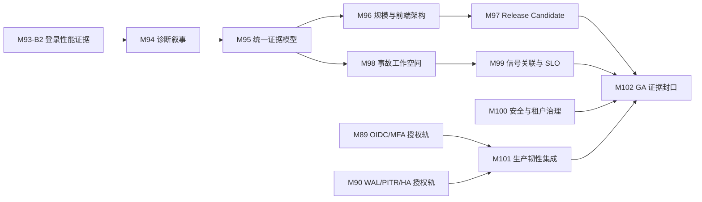

# 下一阶段项目推进长计划：M93-B2–M102

- Status: Active（当前唯一执行入口）
- Updated: 2026-08-10
- Planning horizon: 12–16 个有效开发周，不含组织授权等待时间
- Baseline: M93-C（commit `97bff3f`；tag `baseline-m93c-tech-console-20260809`；CI `31322604425` 全绿）
- 上位路线：[`long-term-roadmap.md`](long-term-roadmap.md)
- 打磨合同：[`polish-plan.md`](polish-plan.md)
- 归档规范：[`ARCHIVING.md`](ARCHIVING.md)

## 0. 计划定位

项目已经完成从基础运维控制台到 AIOps 闭环平台的功能建设，下一阶段的核心不再是增加页面数量，
而是把现有能力做成可快速决策、可规模验证、可安全交付、可持续演进的产品。

本计划取代旧的 M93–M97 简版执行顺序，并把路线延伸到 M102。执行顺序遵循五条主线：

1. 先关闭登录视觉性能证据，避免继续背负未经验证的体验声明。
2. 把诊断、洞察和证据统一成 SRE 可在 10 秒内理解的产品叙事。
3. 用大规模 fixture、后端基准和前端渲染预算证明系统不会在大 fleet 下失控。
4. 先产出可验证的 Release Candidate，再推进事故协作、信号关联和生产治理。
5. 只有身份、数据韧性和供应链证据同时满足时，才允许进入 GA；否则保持 RC 状态。

## 1. 当前基线与真实差距

| 维度 | M93-C 已有能力 | 下一阶段缺口 |
|---|---|---|
| 产品价值 | 确定性诊断、引用式 AI、聚合态势、18 个分析器、受控操作闭环 | 诊断详情仍偏功能拼接，缺少统一根因卡、证据时间线和影响叙事 |
| 前端体验 | 全屏科技登录页、可收起侧栏、无白屏底板、双视口 42/42 | 登录性能无独立预算；34 个视图各自持有布局；主题样式存在多层历史覆盖 |
| 数据契约 | OpenAPI/typegen、finding 契约、错误码治理、黄金回放 | finding、diagnosis、inspection 的证据展示模型仍不统一 |
| 规模性能 | 虚拟列表、拓扑并发采集、少量 benchmark | 无 500 节点 / 50k Pod / 100k Event 的可重复全链路证据 |
| 工程质量 | 全局覆盖率 60.03%、核心包 ≥70%、fuzz/race/axe/bundle 门禁 | 性能回归尚未 fail-closed；关键用户旅程覆盖仍集中在 smoke |
| 交付供应链 | SHA256、release verify、签名 fail-closed 结构、Compose/Helm/Kustomize | 无正式 RC/GA、SBOM/provenance 聚合清单、离线升级回滚证据 |
| 生产身份 | 本地账号、四角色、会话和审计；OIDC/MFA 就绪检查 | M89 真实 OIDC/MFA 需要组织授权，不能对外宣称生产身份完成 |
| 数据韧性 | 逻辑备份恢复、隔离恢复演练、恢复就绪检查 | M90 WAL/PITR/HA 需要基础设施和组织授权 |

## 2. 阶段目标与成功定义

### 2.1 产品目标

- 操作者在诊断详情首屏 10 秒内回答：哪里异常、影响谁、证据是什么、下一步能做什么。
- 任一规则结论最多三次交互可到达原始资源或不可变证据引用。
- AI 只解释已有证据；引用缺失、过期或不一致时必须显式降级，不生成无来源结论。
- 同一资源的 diagnosis、finding、inspection 和 SLO 信号使用一致的严重度、时间和来源语义。

### 2.2 工程目标

- 500 节点 / 50k Pod / 100k Event fixture 可重复生成，关键 API 和前端页面均有版本化预算。
- 性能门禁先以报告模式运行，连续两个稳定周期后才转 fail-closed，避免用偶发噪声阻断开发。
- 核心用户旅程具备 Desktop/Mobile Playwright、axe、console error 和关键视觉边界断言。
- 每个里程碑都有 change-record、门禁结果、artifact 路径、基线 tag 和远端 CI 证据。

### 2.3 交付目标

- RC 产物包含镜像、Helm/Kustomize、离线包、SHA256SUMS、SBOM、provenance 和签名验证入口。
- 升级与回滚在全新环境重复演练，不以“能构建”替代“能安装、能升级、能恢复”。
- M89/M90 未完成时只发布 RC，不把本地账号或逻辑备份描述成生产身份与生产 HA。

## 3. 依赖关系与阶段门

| 阶段门 | 必须满足 | 不满足时处理 |
|---|---|---|
| Gate A：产品叙事 | M94/M95 三条黄金场景闭环；证据引用可追溯；无安全边界扩张 | 不进入规模阶段，继续修模型与交互 |
| Gate B：规模证据 | M96 fixture、预算、报告和稳定性通过；前端无无界 DOM | 性能门禁保持 warning，不进入 RC |
| Gate C：Release Candidate | M97 安装、升级、回滚、校验、SBOM、签名验证全通过 | 只保留开发构建，不创建 RC |
| Gate D：GA | M89/M90/M100/M101 完成；两次独立全新环境演练；零未解释 critical gate | 维持 RC，明确外部依赖与缺口 |

## 4. 主线里程碑

### M93-B2：登录页性能证据与预算（2–3 天）— ✅ 已验收（2026-08-10，`baseline-m93b2-login-perf-20260810`）

**目标**：关闭 M92/M93 唯一未完成项，证明粒子、拓扑和认证动效在目标设备上成本可控。

**范围**：

- 建立登录页专属 JS/CSS 体积统计，不把全局 bundle gate 当作登录页预算。
- 采集桌面正常模式、移动端降级模式、reduced-motion 三种路径的帧耗、长任务和内存快照。
- 基于实际采样调整粒子密度、DPR 上限、连接半径和隐藏暂停策略；不以肉眼判断替代数据。
- CI 先产出趋势报告；只有稳定样本足够后才设置 fail-closed 阈值。

**交付物**：性能脚本、版本化基线 JSON、CI artifact、预算说明、change-record。

**验收**：

- Desktop 与 Mobile 均有三次以上可重复采样，波动范围和测试环境写入报告。
- reduced-motion 保持静态帧，页面隐藏时 RAF 停止，恢复后无粒子突跳。
- LoginView 专属 JS/CSS 未超过记录预算；超限时 CI 给出具体 chunk 和增量来源。
- M93-A 数据真实性、安全边界和 42/42 浏览器回归不回退。

### M94：诊断叙事与证据时间线（5–7 天）— 第三步（根因卡 + 时间线 + 行动区 + 深链）✅ 已落地（2026-08-10，`baseline-m94c-deep-links-20260810`）

**当前状态**：根因卡、只读证据时间线、类型化行动区、关联入口深链（资源详情/工作负载/审计）已完成并归档；回放模式为 M94 剩余增量（新 change-record 归档）。

**目标**：把诊断详情从“字段集合”升级为“10 秒看清根因”的工作界面。

**范围**：

- 根因卡：主结论、影响面、严重度、首次观察、当前状态、置信来源。
- 证据时间线：资源状态、Event、日志摘录、告警、变更与自动化结果使用统一时间轴。
- 行动区：区分只读建议、需要 dry-run 的受控动作、无权限动作和不可用依赖。
- 回放模式：按事件时间重放 M81 insight 链路，不重新生成或伪造历史 AI 结论。
- 深链：从诊断可直接到资源详情、拓扑节点、相关事件和审计记录。

**架构前置**：新增 ADR，定义证据时间、来源、不可变引用、完整性和缺失语义。

**黄金场景**：Node NotReady、Deployment unavailable、OOMKilled；至少再补一条 Service 无后端场景。

**验收**：

- 三条主场景均可在首屏看到根因与影响，不依赖展开所有抽屉。
- 任一结论可以定位到原始 evidence；AI 引用失效时显示降级原因。
- API 契约、领域单测、Playwright 关键旅程、axe 和 kind E2E 全部通过。
- 不新增任意命令、Pod exec、WebShell 或绕过确认的写操作。

### M95：统一 Finding 与证据模型（5–7 天）— ✅ 已落地（2026-08-10，后端 `baseline-m95-finding-detail-v2-20260810`；前端 `baseline-m95b-finding-evidence-ui-20260810`）

**当前状态**：后端 `FindingDetail v2`（规则身份/证据引用/类型化建议/版本信息）、v1→v2 兼容层、
共享严重度映射（`SeverityRank`/`NormalizeSeverity`/`MaxSeverity`）、按资源合并保留规则来源、
golden `DatasetVersion` 1.2 + 迁移提示、前端四个面共享同一证据组件、真实响应 Desktop/Mobile
Playwright 回归和移动端横向滚动约束均已完成并归档。

**目标**：让 18 个分析器、诊断、巡检和治理态势共享“规则 → 证据 → 建议”的稳定模型。

**范围**：

- 定义 `FindingDetail v2`：规则身份、资源引用、严重度、证据引用、建议、可执行能力和版本信息。
- posture、optimization、diagnosis、inspection 使用同一证据组件和严重度映射。
- 同一资源的重复 finding 合并展示，但保留每条规则来源与原始 ID。
- 建议明确标记 `advisory`、`controlled_action_available`、`manual_only`，默认不自动执行。
- 提供 v1→v2 兼容层、迁移说明和 golden dataset 版本升级策略。

**验收**：

- 18 个分析器通过 schema parity 与序列化快照测试。
- 任一 finding 最多三次交互到达原始资源和规则来源。
- 旧 API 消费者在兼容窗口内继续工作；破坏性变更必须由 OASdiff 拒绝或显式版本化。
- DatasetVersion 更新，旧快照仍可读取并给出迁移提示。

### M96：规模证据与前端基础架构收敛（7–10 天）

**目标**：证明大规模 fleet 可控，同时处理当前路由壳层和主题覆盖的结构性技术债。

**进度（2026-08-10，M96-A/B/C/D + Gate B local）**：已落地 `m96-v1` 确定性 fixture 配置、流式 gzip NDJSON 生成/校验器、包含 P50/P95/P99/heap/goroutine/分页/取消/超时/背压的后端 report-mode 基准、桌面/移动端各 3 次 50k Pod 前端 DOM/交互基线，以及认证单壳层和四层 active CSS report-mode 基线；新增 Gate B 聚合器并在本地验证通过。Hosted CI 仍需在提交后的完整 artifact 下载链路中通过，性能阈值继续保持 report mode。

**Gate B 当前状态**：本地 `m96-gate-b.json` 已通过 fixture identity、backend invariants、frontend 6-sample hard invariants 和 CSS layer audit；Hosted CI job 已接入但尚未运行。M97 工具链已实现，本轮只收尾本地 RC 演练和归档，不推进后续里程碑。

**规模范围**：

- 生成 500 Node / 50k Pod / 100k Event 的确定性 fixture，覆盖拓扑、工作负载、搜索和历史窗口。
- 后端记录 P50/P95/P99、内存峰值、goroutine、超时、取消、分页和背压行为。
- 前端记录首屏完成时间、交互响应、长任务、内存、DOM 节点和虚拟列表窗口大小。
- 基准输出机器、运行时、样本量和提交信息，禁止只留终端文本。

**前端架构范围**：

- 将认证后的 `ConsoleLayout` 提升为稳定嵌套路由壳层，业务路由只替换 `.page-content`。
- 保证单个认证会话只挂载一个 sidebar/topbar，导航期间不存在双壳层或空壳层。
- 梳理 `base.css`、`console-theme.css`、`motion.css`、`premium-ui.css` 的职责和覆盖顺序；
  删除失效主题覆盖，形成可审计的 token 与组件层。
- 为主题、折叠侧栏、关键页面和响应式断点建立截图基线与像素差容差。

**验收**：

- 50k Pod 场景 DOM 节点有硬上限，滚动无明显跳变，查询和筛选不复制全量响应对象。
- 关键 API 超时或取消后无 goroutine 泄漏；超阈值生成结构化报告。
- 路由切换始终只有一个 `.app-shell`，侧栏状态保持，登录路由不加载控制台壳层。
- 样式体积和选择器数量不高于 M93-C 基线；删除的规则由视觉回归证明无行为损失。

### M97：Release Candidate 与供应链闭环（5–7 天）

**进度（2026-08-10，local lifecycle and multi-architecture smoke verified）**：已实现 RC-only tag 校验、`aiops.release-manifest/v1`、OCI archive digest 绑定、SPDX SBOM 输入、provenance、Helm/Kustomize/离线包、严格 checksum/Cosign 入口和 kind 生命周期演练脚本。Kustomize 与 Helm 的安装、升级、回滚、健康检查、认证和清理已通过；前端 amd64/arm64 OCI smoke build 已通过。最终状态以 `.artifacts/m97-release/` 的最终干净修订证据和 Hosted GitHub Release 结果为准；缺少远端证据时保持 `Blocked/Deferred`，不创建 GA 声明。

**目标**：产出可以安装、验证、升级和回滚的 RC，而不是只创建一个标签。

**范围**：

- 语义化 RC tag、GitHub Release、镜像清单、SHA256SUMS、SBOM、provenance 和签名验证。
- 生成统一 release manifest，关联 commit、镜像 digest、chart、Kustomize、SBOM 和验证命令。
- 提供在线与离线安装包；离线包包含镜像、配置模板、校验文件和升级/回滚说明。
- 在全新环境执行安装、健康检查、升级、回滚和卸载清理。

**验收**：

- 所有产物均以 digest 固定；签名或 checksum 任一步失败时流程 fail-closed。
- Helm 与 Kustomize 两条安装路径都能从零部署，并通过同一健康与认证检查。
- 升级失败可以恢复到上一 RC，数据库迁移回滚边界有明确说明。
- 未完成 M89/M90 时版本保持 RC，不使用 GA 或 production-ready 描述。

### M98：事故工作空间与协作闭环（5–8 天）

**目标**：把单条诊断提升为可交接、可追踪、可复盘的事故工作空间。

**范围**：

- 基于现有 append-only 诊断工作流扩展事故编号、负责人、关注者、状态、SLA 和时间线。
- 人工备注与系统事件分离；备注正文不进入通用审计详情，避免扩大敏感信息暴露。
- 支持从 diagnosis/finding 创建事故，但禁止同一来源无限重复创建。
- 交接、确认、解决、驳回和重新打开保持显式状态机与审计。
- 提供只读复盘视图，展示证据、决策、动作和结果，不修改历史记录。

**验收**：

- 并发更新使用版本或 compare-and-swap，冲突返回明确 409，不覆盖他人操作。
- 权限矩阵覆盖系统管理员、运维管理员、审计员和只读观察者。
- Playwright 覆盖创建、认领、交接、解决、重开与无权限路径。
- 事故导出默认脱敏，不包含凭据、Secret 值、Cookie、AI prompt 或自由备注全文。

### M99：信号关联、SLO 与影响分析（6–9 天）

**目标**：把事件、指标、日志、变更、拓扑和 SLO 关联到同一资源与时间窗口，减少手工跳转。

**范围**：

- 统一 `SignalRef`：来源、资源、时间、完整性、采样窗口和可用深链。
- 从 SLO burn、告警和异常事件进入相关资源、拓扑路径、最近变更和诊断。
- 影响分析只基于真实拓扑和已加载边界，不推断未观察到的跨集群依赖。
- 告警去重按稳定指纹、时间窗口和资源身份执行，保留原始事件计数。
- AI 可总结关联信号，但不改变 SLO、严重度、事故状态或自动化权限。

**验收**：

- 至少覆盖一次 Deployment 变更后引发错误预算消耗的完整黄金场景。
- 时间窗口、缺样本和数据延迟在 UI 中显式可见，不把缺失数据当作健康。
- 关联结果有确定性测试和 golden replay；同样输入得到稳定排序。
- 任何跨 Namespace/Workspace 深链继续经过后端授权校验。

### M100：安全、租户与运行治理加固（5–8 天）

**目标**：在不等待外部身份 Provider 的前提下，完成可本地验证的生产治理工作。

**范围**：

- 全路由角色/Workspace/Cluster/Namespace 权限矩阵生成与差异检查。
- 会话设备、撤销、密码变更、管理员重置和 auth_version 失效旅程复验。
- 审计完整性、导出脱敏、敏感字段静态扫描和日志脱敏门禁。
- 依赖漏洞、许可证、镜像基础层和 SBOM 差异报告；critical 默认 fail-closed。
- 建立安全响应时限：critical 立即阻断，high 必须有到期处置记录。

**验收**：

- 未授权读写路径的契约测试覆盖率达到 100%，前后端导航限制不作为唯一安全措施。
- Secret 值、kubeconfig、token、Cookie 和密码不进入 API、审计、日志、artifact 或前端状态。
- 安全扫描结果可追溯到 release manifest；例外有负责人、理由和到期时间。
- M89 未获授权时继续明确使用本地身份边界，不模拟 OIDC/MFA 已完成。

### M101：生产身份与数据韧性集成（7–12 天 + 授权等待）

**目标**：把 M89/M90 的外部能力接入真实环境并形成可重复演练证据。

**M89 身份轨**：

- 真实 OIDC discovery/JWKS、issuer/audience/nonce/state 校验、角色/Workspace 映射。
- MFA 由身份 Provider 执行，平台只消费已验证声明，不自行保存 OTP seed。
- Provider 不可用时新登录 fail-closed；既有会话策略按 ADR 执行。

**M90 数据轨**：

- WAL 归档、PITR、恢复点验证、迁移前备份和多副本优雅停机。
- 明确 RPO/RTO 目标并以真实演练测量；逻辑备份继续作为独立防线。
- 故障注入覆盖数据库重启、网络中断、磁盘压力和不完整恢复点。

**验收**：

- 使用组织批准的 Provider 和基础设施完成至少两次独立演练。
- 身份、恢复和审计证据脱敏归档；失败路径有可执行回滚步骤。
- RPO/RTO 只引用实测结果，不以配置值或设计目标代替。
- 无授权或环境不具备时状态保持 Blocked/Deferred，不降低门禁伪造完成。

### M102：GA 证据封口与对外验证（5–7 天）

**目标**：以证据而非功能数量决定是否进入 GA。

**范围**：

- 汇总产品、性能、安全、身份、数据韧性、供应链和安装升级证据。
- 在两套全新环境执行相同 release manifest 的安装、升级、回滚、备份恢复和关键旅程。
- 生成最终测试矩阵、已知限制、兼容范围、运维手册和安全声明。
- 形成可复现演示：登录 → 态势 → 根因 → 证据 → 受控动作 → 验证 → 事故复盘。

**GA 准入**：

- Gate A–D 全部通过；required CI 无跳过、无未解释 failure、无过期安全例外。
- 两次全新环境演练使用同一不可变产物，结果一致。
- critical 安全发现为 0；high 安全发现均有在期处置计划。
- M89/M90 未完成时不得标记 GA，只能发布新的 RC 与明确缺口说明。

## 5. 12–16 周推进节奏

| 周期 | 主任务 | 可并行任务 | 阶段输出 |
|---|---|---|---|
| Week 1 | M93-B2 登录性能证据 | M94 ADR 与数据模型预研 | M93 正式关闭 |
| Week 2–3 | M94 诊断叙事 | 黄金数据补齐 | Gate A 第一部分 |
| Week 4–5 | M95 统一证据模型 | M100 权限矩阵生成器预研 | Gate A 完成 |
| Week 6–8 | M96 规模与前端架构 | M89/M90 授权准备 | Gate B 完成 |
| Week 9 | M97 Release Candidate | M98 领域模型 ADR | Gate C 完成 |
| Week 10–11 | M98 事故工作空间 | M100 安全治理 | 协作闭环 |
| Week 12–13 | M99 信号关联与 SLO | M100 收口；M101 外部演练 | 影响分析闭环 |
| Week 14–15 | M101 生产韧性集成 | M102 证据矩阵准备 | Gate D 候选 |
| Week 16 | M102 GA 证据封口 | 文档、演示、迁移复验 | GA 或保持 RC |

执行按有效开发周计算。若 M89/M90 授权晚于 Week 13，主线继续完成 M98–M100，版本保持 RC，
不通过压缩测试或降低准入条件追赶日期。

## 6. 并行工作轨道

| 轨道 | 责任边界 | 主要里程碑 | 并行规则 |
|---|---|---|---|
| Product/Evidence | 诊断叙事、统一证据、事故工作空间、信号关联 | M94/M95/M98/M99 | 同一时间只允许一个主产品模型变更 |
| Performance/Foundation | 登录预算、fixture、基准、前端壳层与主题收敛 | M93-B2/M96 | 可与 ADR/授权准备并行，不与大 UI 重构重叠 |
| Security/Reliability | 权限、会话、审计、OIDC、WAL/PITR/HA | M100/M101/M89/M90 | 外部工作必须有独立状态与证据，不阻塞本地主线 |
| Release/Quality | CI、SBOM、签名、安装升级、RC/GA 证据 | M97/M102 | 只消费已关闭里程碑，不在发布阶段补功能 |

## 7. 项目级指标

| 指标 | 当前基线 | 目标或确定方式 |
|---|---|---|
| 根因理解时间 | 未形成统一测量 | M94 用固定黄金任务采样，目标中位数 ≤10 秒 |
| 证据可达性 | 页面间分散 | M95 任一结论 ≤3 次交互到原始证据 |
| AI 引用完整性 | 引用式解释已存在 | 关键结论 100% 有有效引用；失效时 100% 显式降级 |
| 浏览器回归 | 42/42 | 每个新增关键旅程双视口覆盖，critical/serious axe = 0 |
| 单测覆盖 | 全局 60.03%，核心包 ≥70% | 核心变更包 ≥80%；全局只在真实补测后渐进提升 |
| 性能预算 | 无大规模全链路基线 | M96 建立绝对基线；后续默认回归不超过稳定基线 10% |
| 供应链完整性 | 本地 verify 与结构化门禁 | RC/GA 产物 100% 有 digest、checksum、SBOM、provenance、签名 |
| 恢复能力 | 逻辑恢复演练 | M101 以实测 RPO/RTO 为准，不预写目标达成 |

## 8. 前十个工作日任务板

| 日程 | 任务 | 产物 | 完成条件 |
|---|---|---|---|
| Day 1 | 登录页 chunk 与运行成本基线 | bundle 明细、采样脚本、环境说明 | 三种模式可重复执行 |
| Day 2 | 粒子/DPR/长任务调优 | 基线 JSON、CI artifact | 数据真实性与视觉回归不变 |
| Day 3 | M93-B2 门禁与归档 | change-record、tag、CI | M93 正式关闭 |
| Day 4 | M94 证据时间 ADR | 时间、来源、引用、缺失语义 | ADR Accepted |
| Day 5 | 根因卡与时间线 API 契约 | OpenAPI、领域模型、错误语义 | typegen/OASdiff 通过 |
| Day 6 | Node NotReady / Deployment unavailable 数据路径 | 服务层与测试 | 原始 evidence 可追溯 |
| Day 7 | OOMKilled / Service 无后端数据路径 | 服务层与测试 | 四场景稳定排序 |
| Day 8 | 根因卡与时间线 UI | 桌面/移动视图 | 首屏无重叠、无假数据 |
| Day 9 | 深链、降级、权限和空态 | 用户旅程测试 | 失败路径可解释 |
| Day 10 | kind/Playwright/axe/归档 | 完整证据包 | Gate A 第一部分通过 |

## 9. 风险登记与应对

| 风险 | 影响 | 预警信号 | 应对 |
|---|---|---|---|
| 统一证据模型范围膨胀 | M94/M95 延期并牵动大量 API | 同时修改超过三个领域包 | 先覆盖四个黄金场景，再扩展 18 分析器 |
| 前端壳层重构引发 34 视图回归 | 导航、权限和响应式破坏 | 多个页面出现双壳层或布局漂移 | M96 单独里程碑，截图基线 + 全量 Playwright 后再合并 |
| 性能环境噪声 | CI 误报、团队忽略门禁 | 同提交波动 >15% | 报告模式、固定 runner、重复采样、稳定后 fail-closed |
| AI 解释掩盖证据缺失 | 产品可信度下降 | 无引用文本仍显示高置信 | 服务端引用校验 + UI 降级，不允许前端补写引用 |
| OIDC/PITR 授权长期未到 | GA 被阻塞 | Week 8 仍无环境与负责人 | 继续 RC 路线，按 Deferred 归档，不降低 Gate D |
| 发布阶段继续加功能 | RC 不稳定 | M97 后仍有契约新增 | Release freeze，只接受 blocker/security/recovery 修复 |
| 文档与真实状态偏离 | 对外交付失真 | 计划写完成但无 artifact/tag/CI | change-record、状态文档和远端证据三方一致才关闭 |

## 10. 每个里程碑的 Definition of Done

- 范围、非目标、API、安全边界、迁移和回退策略已写清楚；架构变化先有 ADR。
- 领域单测、契约、typegen、lint、build、bundle、race 和适用的 kind/Playwright/axe 门禁通过。
- 性能、视觉、恢复或供应链声明有结构化 artifact，可在另一台环境复现。
- 新增用户旅程覆盖正常、空态、错误、无权限、超时和 reduced-motion/移动端中的适用路径。
- `docs/changes/YYYY-MM-DD-<slug>.md`、CHANGELOG、PROJECT_STATUS 和路线状态同步。
- 功能提交、baseline tag、`origin/main` 和 CI head SHA 一致，工作树干净。
- 外部依赖未满足时明确标记 Blocked/Deferred，不用 mock 或配置占位伪造生产能力。

## 11. 明确非目标

- 不建设通用 PaaS、完整 DevOps 套件、应用商店或 KubeSphere 全量替代品。
- 不增加任意 YAML/CRD 编辑、Pod exec/WebShell、Secret 值展示或任意集群命令执行。
- 不在本阶段引入动态 OPA/Rego、GPU 调度、边缘计算、自定义 PromQL/LogQL 编辑器。
- 不用更多装饰动画替代诊断效率；新动效必须服务状态、因果或操作反馈。
- 不在没有真实 Provider、WAL/PITR/HA 演练时宣称生产身份、生产 RPO/RTO 或高可用完成。
- 不以单次 benchmark、单张截图或聊天结论作为里程碑验收证据。

## 12. 立即执行顺序

1. 创建 M93-B2 任务，先采样后定预算，不直接猜测阈值。
2. M93-B2 关闭后立即编写 M94 证据时间 ADR，并冻结四条黄金场景。
3. M94 合并前准备 M95 `FindingDetail v2` 草案，但不并行修改公共契约。
4. M95 关闭后再启动 M96 壳层重构与大规模 fixture，避免产品模型和基础架构同时震荡。
5. Hosted CI Gate B 通过后进入 M97 Release Candidate；在此之前保留 M96 Gate B pending 状态。
6. M89/M90 从现在开始准备授权与环境，但其完成状态独立于本地主线，最终只在 Gate D 汇合。
