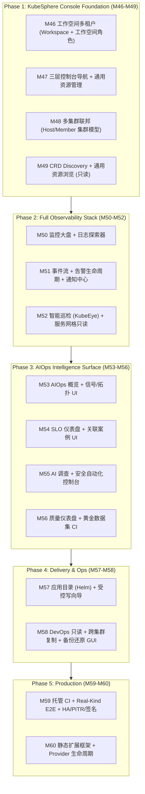

# Post-M45 Development Roadmap (Revised v2)

- Status: Proposed (awaiting review)
- Created: 2026-07-31
- Revised: 2026-07-31 (KubeSphere-leaning v2 + AIOps core emphasis)
- Baseline: M1–M45 development complete; `baseline-m32-20260731` tag; M33–M45 commits on local `main`
- Supersedes: the earlier KubeSphere-leaning v1 draft in this same file
- Audience: development Agent, reviewer, and release owner

## 0. Design Philosophy

### 0.1 Product Positioning

**KubeSphere-style PaaS Console + AIOps Intelligence Core.**

本平台以 **KubeSphere 风格的能力平面为产品形态主干**——三层控制台（平台/工作空间/集群）、功能域导航、多集群联邦、全栈可观测性、应用目录与受控写向导——构建一个完整的 Kubernetes 管理与运维控制台；在此之上，**AIOps Intelligence Core（M39–M45 已完成）作为差异化核心**，不是独立模块，而是**渗透到每个能力域的智能层**，形成"**可见、可管、可观测、可诊断、可自愈**"的完整闭环。

与 v1 路线相比，v2 进一步向 KubeSphere 倾斜：
- **更深的工作空间模型**：引入 workspace-level roles（admin/editor/viewer），不仅是 owner/maintainer
- **多集群联邦作为一等公民**：M48 独立里程碑，借鉴 KubeSphere host/member 集群模型
- **全栈可观测性**：独立 Phase 2，包含监控/日志/事件/告警/通知 + 服务网格只读 + 智能巡检
- **三层控制台贯穿**：平台级/工作空间级/集群级视图在每个能力域都有体现

```
┌──────────────────────────────────────────────────────────────────────┐
│              统一控制台 (Unified Console) — KubeSphere 风格              │
│   平台级 / 工作空间级 / 集群级 三层视图（借鉴 KubeSphere Console）       │
├──────────────────────────────────────────────────────────────────────┤
│  ┌─────────┐ ┌─────────┐ ┌─────────┐ ┌─────────┐ ┌─────────┐        │
│  │ 工作台   │ │ 集群管理 │ │ 资源管理 │ │ 可观测性 │ │ DevOps  │        │
│  │ (Dashboard)│ │(Federation)│ │(CRUD+CRD)│ │(Mon/Log)│ │(GitOps) │        │
│  └────┬────┘ └────┬────┘ └────┬────┘ └────┬────┘ └────┬────┘        │
│       └───────────┴───────────┴───────────┴───────────┘             │
│  ┌─────────┐ ┌─────────┐ ┌─────────┐ ┌─────────┐                    │
│  │ 应用目录 │ │ 访问控制 │ │ 平台设置 │ │ AIOps智能│                    │
│  │ (Helm)  │ │ (IAM)   │ │ (Config)│ │ (Core)  │                    │
│  └────┬────┘ └────┬────┘ └────┬────┘ └────┬────┘                    │
│       └───────────┴───────────┴───────────┘                         │
│                   ↓ 所有能力域数据汇聚到 AIOps Core ↓                   │
│  ┌────────────────────────────────────────────────────────────────┐  │
│  │           AIOps Intelligence Core (差异化核心)                    │  │
│  │  信号归一 → 拓扑时序 → SLO评估 → 确定性RCA → AI调查 → 安全自动化   │  │
│  │         + 巡检规则 + 智能告警闭环 + 质量回归门禁                    │  │
│  └────────────────────────────────────────────────────────────────┘  │
├──────────────────────────────────────────────────────────────────────┤
│  ┌─────────┐ ┌─────────┐ ┌─────────┐ ┌─────────┐ ┌─────────┐        │
│  │ 身份授权 │ │ 工作空间 │ │ 多集群   │ │ 审计治理 │ │ 静态扩展 │        │
│  │ (OIDC)  │ │(Project)│ │(Federation)│ │(Audit) │ │(Registry)│       │
│  └─────────┘ └─────────┘ └─────────┘ └─────────┘ └─────────┘        │
└──────────────────────────────────────────────────────────────────────┘
```

### 0.2 KubeSphere Borrowing Strategy (v2 deepened)

借鉴 KubeSphere 的**工程模式、产品形态与功能域组织**，但不引入其**动态扩展机制**和**与本项目安全边界冲突的能力**：

| KubeSphere 模式 | v2 采纳方式 | v1 对比 |
|---|---|---|
| 三层控制台视图（平台/工作空间/集群） | **加深**: 每个能力域都体现三层视图，不仅是导航 | v1 仅导航重构 |
| Workspace 多租户 + 工作空间角色 | **加深**: 引入 workspace-admin/editor/viewer 三角色（非平台角色） | v1 仅 owner/maintainer |
| 多集群联邦（host/member 集群模型） | **新增**: M48 独立里程碑，借鉴 KubeSphere 多集群管理 | v1 无独立联邦里程碑 |
| 功能域导航（工作台/集群/监控/DevOps/应用/访问控制） | 采纳: 重构控制台为 9 大功能域 | 同 v1 |
| 可观测性全栈（WizTelemetry 模式） | **加深**: 独立 Phase 2，含监控/日志/事件/告警/通知/巡检/服务网格只读 | v1 拆分较散 |
| KubeEye 巡检（InspectRule CRD） | 采纳思想: 编译期巡检规则 catalog + 周期执行 | 同 v1 |
| 告警通知四元组（Config/Receiver/Router/Silence） | 采纳: M51 通知中心 + 抑制规则 | 同 v1 |
| 服务网格（Istio）只读接入 | **新增**: M52 作为可观测数据源只读接入，不做治理执行 | v1 明确拒绝 |
| CRD 管理（CRD discovery + 通用浏览） | **加深**: M49 独立里程碑 | v1 合并在 M47 |
| 微内核+InstallPlan 扩展 | 拒绝动态: 改为编译期 provider registry + 静态 OpenAPI 聚合 | 同 v1 |
| 透明 K8s API 代理（/apis/ 透传） | 拒绝: 保持显式 cluster_id + 固定 GVR 白名单 | 同 v1 |
| 完整 Workspace 多集群传播（WorkspaceTemplate） | 拒绝: Project 跨集群用 SQL 表达，无 controller 同步 | 同 v1 |
| DevOps 流水线引擎（Jenkins/ArgoCD 控制面） | 拒绝控制面: 只读接入 GitOps/发布元数据作为变更证据 | 同 v1 |
| 应用商店（OpenPitrix） | 简化: 仅 Helm 应用目录，不做审核/分发全流程 | 同 v1 |

### 0.3 AIOps Core Emphasis (differentiated intelligence layer)

AIOps 能力（M39–M45）作为**差异化核心**，通过两种方式体现：

**方式一：独立 AIOps Surface Phase（M53–M56）**——把后端 AIOps 闭环完整暴露到前端，形成"看见→诊断→调查→执行→验证"可视化闭环。

**方式二：渗透到每个 Capability 域**——每个能力域都有明确的 AIOps 集成点：

| Capability 域 | AIOps 渗透点 | 实现里程碑 |
|---|---|---|
| 工作空间/项目 | 项目级 SLO 聚合 + 项目级案例视图 | M46 + M54 |
| 资源管理 | 资源详情页内嵌诊断证据 + 拓扑位置 + 关联案例 | M47 + M53 |
| 多集群联邦 | 跨集群信号归一 + 跨集群案例关联 | M48 + M53 |
| CRD 浏览 | CRD 资源作为拓扑节点 + 变更候选 | M49 + M53 |
| 可观测性 | 监控大盘叠加 SLO 状态 + 信号归一化 + 智能告警 | M50 + M54 |
| 事件/告警 | 告警触发 M42 关联 + M43 AI 调查建议 | M51 + M55 |
| 巡检 | 巡检结果作为信号进入 M39 signal 模型 | M52 + M53 |
| 服务网格 | 流量指标作为 SLO 证据 + 拓扑边 | M52 + M54 |
| DevOps | 发布事件作为变更证据进入 RCA 关联 | M58 + M55 |
| 应用目录 | Helm release 作为变更候选进入拓扑 | M57 + M53 |
| 备份还原 | 备份状态作为 runbook 资格检查证据 | M58 + M55 |

### 0.4 Reference Projects Summary

| 参考 | 定位 | 借鉴要点 |
|---|---|---|
| **KubeSphere v4.1.2** | 通用 PaaS OS | 三层控制台、工作空间多租户、多集群联邦、可观测性全栈、KubeEye 巡检、告警通知四元组、CRD 管理、服务网格只读 |
| **KRM** | K8s 资源图形化管理 | 表单式写操作向导、资源派生、跨集群复制、可视化备份还原 |
| **Ratel** | KRM 前身 | 50+ 截图的设计原型（容器编辑器、亲和性、Secret 模板） |
| **aiops-platform** | AIOps 平台（本项目） | M39–M45 AIOps 闭环已完成后端，需前端暴露 + KubeSphere 风格能力域扩展 |

## 1. Roadmap Overview

五阶段 15 里程碑（M46–M60），按"**先建 KubeSphere 风格控制台底座 → 再补全栈可观测性 → 再暴露 AIOps 智能 → 再补交付运维 → 最后生产加固**"的顺序：

| Phase | Milestones | Theme | 借鉴来源 |
|---|---|---|---|
| Phase 1 | M46–M49 | KubeSphere 控制台底座（工作空间/三层导航/多集群/CRD） | KubeSphere Console + Federation + CRD |
| Phase 2 | M50–M52 | 全栈可观测性（监控/日志/事件/告警/通知/巡检/网格） | KubeSphere WizTelemetry + KubeEye |
| Phase 3 | M53–M56 | AIOps Intelligence Surface（前端暴露 + 集成） | M39–M45 后端能力 |
| Phase 4 | M57–M58 | 交付与运维集成（Helm/GitOps/跨集群/备份还原） | KubeSphere DevOps/AppStore（简化） |
| Phase 5 | M59–M60 | 生产加固与静态扩展框架 | KubeSphere LuBan（静态子集） |



## 2. Phase 1: KubeSphere 控制台底座（M46–M49）

**Goal**: 借鉴 KubeSphere 控制台模式，把平台从"只读诊断工具"升级为"KubeSphere 风格的完整 K8s 管理控制台"，建立工作空间多租户、三层导航、多集群联邦和 CRD 浏览底座，为 AIOps 智能提供更丰富的数据底座。

### M46: 工作空间多租户（Workspace + 工作空间角色）

- **借鉴 KubeSphere**: Workspace 三层模型（Global→Cluster→Workspace→Namespace）+ 工作空间角色（admin/editor/viewer）
- **设计原则**: Workspace 是**聚合维度**，不改变现有四角色 + ClusterGrant/NamespaceGrant 授权矩阵；Workspace 仅用于 UI 分组 + 配额统计 + 跨集群 Namespace 归属 + 工作空间级角色管理
- **数据模型**（3 张新表 + 2 张 grant 表）:
  - `workspaces` (id, name, display_name, owner_user_id, metadata_json, created_at, updated_at) — 对应 KubeSphere Workspace CRD 的瘦模型
  - `workspace_memberships` (workspace_id, cluster_id, namespace) — 对应 KubeSphere `kubesphere.io/workspace` label 绑定
  - `workspace_quotas` (workspace_id, hard_cpu_cores, hard_memory_mib, hard_pod_count, hard_namespace_count) — 对应 KubeSphere Workspace ResourceQuota
  - `user_workspace_grants` (user_id, workspace_id, role IN ('workspace_admin','workspace_editor','workspace_viewer')) — 工作空间管理权（非平台角色）
  - `workspace_role_bindings_audit` (workspace_id, user_id, role, granted_by, granted_at) — 工作空间角色绑定审计
- **工作空间角色语义**（KubeSphere 风格，但 bounded）:
  - `workspace_admin`: 编辑 workspace 元数据/添加 membership/设置 quota/管理工作空间角色绑定
  - `workspace_editor`: 查看 workspace 资源 + 触发受控写操作（仍需平台 operations_admin 权限做实际执行）
  - `workspace_viewer`: 只读查看 workspace 资源
  - **关键不变量**: 工作空间角色**不自动获得 namespace 读权限**——namespace 读仍需 ClusterGrant/NamespaceGrant；工作空间角色仅授予 workspace 元数据管理权
- **鉴权不变量**:
  - 四平台角色（system_admin/operations_admin/security_auditor/viewer）不变
  - ClusterGrant/NamespaceGrant 不变，鉴权中间件路径不变
  - WorkspaceGrant 仅授予"编辑 workspace 元数据/添加 membership/设置 quota/管理工作空间角色绑定"的权限
  - SystemAdmin bypass 所有 grant（包括 WorkspaceGrant）
  - 404 > 403 防泄漏不变
- **路由**: `GET/POST/PUT/DELETE /api/v1/workspaces`, `GET/POST/DELETE /api/v1/workspaces/:id/memberships`, `GET/PUT /api/v1/workspaces/:id/quota`, `GET/POST/DELETE /api/v1/workspaces/:id/role-bindings`
- **ADR**: 0061 (工作空间多租户 — SQL 实现、工作空间三角色、不破坏 2D 授权矩阵、WorkspaceGrant 与平台角色分离)
- **迁移**: 000034_workspaces_and_grants.up.sql / .down.sql
- **验收**: 25+ unit tests (service + middleware + handler + 工作空间角色语义); OpenAPI parity; fast gate green
- **Deferred**: 自定义工作空间角色（仅 admin/editor/viewer 三固定角色）、多集群 Workspace 传播 controller、Workspace 级网络隔离、Workspace 级资源配额强制执行（仅统计展示）

### M47: 三层控制台导航 + 通用资源管理

- **借鉴 KubeSphere**: 平台级/工作空间级/集群级三层控制台视图；9 大功能域一级菜单
- **借鉴 KRM**: 表单式资源浏览
- **前端重构**:
  - 侧边导航重构为 9 大功能域：工作台、集群管理、资源管理、可观测性、AIOps 智能、DevOps、应用目录、访问控制、平台设置
  - **三层视图切换器**（顶部全局）: 平台级（跨工作空间）/ 工作空间级（当前 workspace）/ 集群级（当前 cluster），类似 KubeSphere Console 的层级切换
  - 工作空间切换器（顶部全局 Workspace selector，类似 KubeSphere Workspace 切换器）
  - 资源管理视图升级：在现有固定 GVR 基础上，新增按 workspace/cluster/namespace 三层过滤的资源树浏览
- **后端增量**:
  - `GET /api/v1/clusters/:cluster_id/api-resources`: CRD discovery 预览（返回 GVR 列表，M49 完整实现）
  - 资源列表端点新增 `workspace_id` query 参数（可选，按 workspace membership 过滤）
- **ADR**: 0062 (三层控制台 + 功能域导航 — 平台/工作空间/集群三层视图、9 功能域、workspace 过滤)
- **验收**: 导航重构通过 desktop+mobile 响应式; 三层视图切换 round-trip; workspace 过滤 round-trip; fast gate green
- **Deferred**: 自定义功能域导航、动态菜单注入

### M48: 多集群联邦（Host/Member 集群模型）

- **借鉴 KubeSphere**: 多集群管理（host 集群 + member 集群模型）、集群注册/注销、集群健康状态聚合
- **设计**: 在现有 fleet/cluster 模型基础上，引入 host/member 语义和集群联邦视图
- **数据模型增量**（扩展现有 clusters 表）:
  - `clusters` 表新增字段: `cluster_role` IN ('host','member','standalone'), `federation_status` IN ('registered','healthy','degraded','disconnected'), `registered_at`, `last_heartbeat_at`
  - 新表 `cluster_federation_events` (id, cluster_id, event_type, status, message, occurred_at) — 联邦状态变更事件审计
- **后端增量**（扩展现有 cluster/fleet 包）:
  - 集群注册: `POST /api/v1/federation/clusters/register`（SystemOpsAdmin，注册现有 cluster 为 member，复用 kubeconfig）
  - 集群注销: `DELETE /api/v1/federation/clusters/:cluster_id`（SystemOpsAdmin，软删除，保留审计）
  - 集群健康聚合: `GET /api/v1/federation/overview`（返回 host + 所有 member 的健康状态摘要）
  - 集群联邦事件流: `GET /api/v1/federation/events`（bounded，最近 100 条联邦事件）
  - 跨集群资源摘要: `GET /api/v1/federation/resources/summary`（按 GVR 聚合跨集群资源计数，固定 GVR 白名单）
- **关键不变量**:
  - 不引入 KubeSphere 的 Cluster Agent / Tower 模式（保持 kubeconfig 直接连接）
  - 不做集群间资源同步 controller（仅 SQL 聚合视图）
  - 跨集群操作仍走显式 cluster_id + 固定 GVR 白名单
  - 404 > 403 防泄漏不变
- **前端新增**:
  - `FederationOverviewView.vue`（集群管理功能域首页）: host/member 集群拓扑图 + 健康状态卡片 + 联邦事件时间线
  - `ClusterRegistrationView.vue`: 集群注册向导（kubeconfig 上传 → 验证 → 注册为 member）
- **ADR**: 0063 (多集群联邦 — host/member 模型、kubeconfig 直连、无 agent、SQL 聚合视图)
- **迁移**: 000035_cluster_federation.up.sql / .down.sql
- **验收**: 集群注册/注销 round-trip; 联邦概览渲染; 跨集群资源摘要测试; fast gate green
- **Deferred**: Cluster Agent/Tower 模式、集群间资源同步 controller、Workspace 跨集群传播、集群版本兼容性自动检查

### M49: CRD Discovery + 通用资源浏览（只读）

- **借鉴 KubeSphere**: CRD 管理功能域（CRD 列表 + CRD 实例浏览）
- **借鉴 KRM**: CRD 通用资源图形化浏览
- **后端增量**:
  - `GET /api/v1/clusters/:cluster_id/api-resources`: CRD discovery（返回 GVR 列表，含固定白名单 + 动态发现的 CRD）
  - `GET /api/v1/clusters/:cluster_id/custom-resources/:group/:version/:resource`: 通用 CRD 列表（只读，bounded，M35 scope 过滤，limit ≤100）
  - `GET /api/v1/clusters/:cluster_id/custom-resources/:group/:version/:resource/:name`: CRD 详情（只读，manifest redaction 复用 M22）
  - **CRD 白名单策略**: 默认覆盖运维 CRD（Velero/Prometheus/Helm/CertManager/IngressNGINX 等），其他 CRD 按需启用
- **关键不变量**:
  - CRD 资源**只读**——明确拒绝写操作（POST/PUT/DELETE/PATCH）
  - manifest 脱敏复用 M22（Secret/ConfigMap 敏感字段 redaction）
  - 固定 GVR 白名单 + CRD discovery，**不引入透明 K8s API 代理**
  - 404 > 403 防泄漏不变
- **前端新增**:
  - `CustomResourceBrowserView.vue`（资源管理功能域子页）: CRD 列表（左侧 GVR 树）+ 实例列表（右侧表格）+ 详情抽屉（manifest 只读，脱敏后展示）
  - 工作空间/集群/namespace 三层过滤 + GVR 树过滤
- **ADR**: 0064 (CRD 通用浏览 — 固定白名单 + discovery 只读、manifest 脱敏、拒绝写操作)
- **验收**: CRD discovery round-trip; CRD 实例列表 + 详情 round-trip; manifest 脱敏测试; fast gate green
- **Deferred**: CRD 资源的写操作（明确拒绝）、动态 GVR 代理（明确拒绝）、CRD schema 表单生成器

## 3. Phase 2: 全栈可观测性（M50–M52）

**Goal**: 借鉴 KubeSphere WizTelemetry 模式，构建全栈可观测性中心（监控/日志/事件/告警/通知/巡检/服务网格只读），作为 AIOps 智能的丰富数据源。

### M50: 监控大盘 + 日志探索器

- **借鉴 KubeSphere**: WizTelemetry 统一可观测性 APIServer 模式；监控大盘 + 多租户日志查询
- **后端增量**:
  - 监控大盘: `GET /api/v1/clusters/:cluster_id/monitoring/dashboard/:template`: 聚合 M21 metrics history + M37 Prometheus provider，返回固定大盘模板（节点概览/工作负载概览/Pod 概览/工作空间概览）
  - 工作空间级大盘: `GET /api/v1/workspaces/:id/monitoring/dashboard`（按 workspace membership 聚合多集群指标摘要）
  - 日志查询: `POST /api/v1/clusters/:cluster_id/logs/query`: 对接 M37 Loki provider，bounded 查询（时间窗 + 关键词 + namespace 过滤 + limit ≤500）
- **前端新增**:
  - `MonitoringDashboardView.vue`（可观测性功能域）: 固定大盘模板渲染（CPU/内存/网络/磁盘折线图，复用 M21 trend 组件）+ 工作空间级聚合视图
  - `LogExplorerView.vue`（可观测性功能域）: 日志查询界面（时间窗 + namespace + 关键词 + 容器选择器 + 工作空间过滤）+ 结果高亮 + 上下文展开
- **关键不变量**:
  - 固定大盘模板，**不接受自定义 PromQL**
  - 日志查询 bounded（时间窗 + limit），**不接受自定义 LogQL**
  - M35 scope 过滤不变（namespace 级权限）
  - 404 > 403 防泄漏不变
- **ADR**: 0065 (监控大盘 + 日志探索器 — 固定模板、bounded 查询、scope 过滤、工作空间聚合)
- **验收**: 监控大盘渲染; 工作空间聚合视图; 日志查询 round-trip; fast gate green
- **Deferred**: 自定义 PromQL/LogQL 查询（明确拒绝）、Grafana 仪表板导入、自定义大盘编辑器、链路追踪（Jaeger）

### M51: 事件流 + 告警生命周期 + 通知中心

- **借鉴 KubeSphere**: Notification Config/Receiver/Router/Silence 四元组 + 通知历史归档 + 多租户 labelSelector + 11 通知渠道
- **后端增量**（扩展 M37B alertroute + M27 alert）:
  - 事件流: `GET /api/v1/clusters/:cluster_id/events/stream`: SSE 推送 K8s Event（bounded，M35 scope 过滤，backpressure drop-oldest）
  - 通知渠道扩展: 在现有 Webhook 基础上新增 Email（SMTP）、DingTalk（群机器人 webhook）、Feishu（群机器人 webhook）—— V1 实现 4 个渠道
  - 通知接收者: `notification_receivers` 表（name/type/config_json/scope_filter），支持按 cluster/namespace/workspace labelSelector 路由
  - 通知历史: `notification_history` 表（alert_id/receiver/channel/status/sent_at/response_code），可查询可审计
  - 告警抑制: 扩展 M37B silence，新增 inhibit 规则（source_match → target_match 抑制）
- **前端新增**:
  - `EventStreamView.vue`（可观测性功能域）: 实时事件流（SSE + 过滤 + 搜索 + severity badge）
  - `NotificationCenterView.vue`（可观测性功能域，升级现有 notifications）: 接收者管理 tab + 通知历史 tab + 静默规则 tab + 抑制规则 tab
- **关键不变量**:
  - 通知配置不含明文凭证（SMTP password / webhook secret 用 redacted JSON）
  - 通知历史 append-only，可审计
  - 404 > 403 防泄漏不变
- **ADR**: 0066 (事件流 + 通知中心 — SSE bounded、4 渠道、接收者四元组、通知历史归档、抑制规则)
- **迁移**: 000036_notification_receivers_and_history.up.sql / .down.sql
- **验收**: 事件流 SSE; 4 渠道发送测试; 通知历史查询; 抑制规则测试; fast gate green
- **Deferred**: Slack/WeChat/Feishu 工作通知（非群机器人）、通知模板编辑器、通知重试策略 UI、自定义事件过滤表达式

### M52: 智能巡检（KubeEye 风格）+ 服务网格只读

- **借鉴 KubeSphere KubeEye**: InspectRule/InspectPlan/InspectTask/InspectResult 四元组模型；多类型规则
- **借鉴 KubeSphere Service Mesh**: Istio 只读接入作为可观测数据源
- **设计调整**: 巡检规则在代码中编译期注册（保持 M42 deterministic RCA 的可重放性），不引入 CRD 动态规则；巡检结果作为信号进入 M39 signal 模型
- **后端新增** `internal/inspection` 包:
  - `model.go`: RuleDescriptor（code/type/params/severity）、InspectPlan（cluster_id/namespace/rule_codes/schedule）、InspectTask（plan_id/started_at/completed_at/status）、InspectResult（task_id/rule_code/resource/findings/severity）
  - `catalog.go`: V1 规则目录（8 条规则）:
    1. `node_not_ready` — 节点 Ready 状态
    2. `pod_restart_loop` — Pod 重启循环（复用 M18 诊断规则）
    3. `pvc_pending` — PVC 挂起
    4. `resource_quota_near_limit` — ResourceQuota 接近上限
    5. `pdb_unavailable` — PDB 不可用
    6. `hpa_saturated` — HPA 饱和
    7. `image_pull_backoff` — 镜像拉取退避
    8. `namespace_empty` — 空 Namespace（资源浪费检测）
  - `service.go`: RunInspectOnce（同步执行）、ScheduleInspect（周期任务）、ListResults
  - 巡检结果自动 IngestBatch 到 M39 signal 模型（signal_id = `inspection.<rule_code>`）
- **HTTP 路由**: `GET /api/v1/aiops/inspection/rules`, `GET/POST /api/v1/aiops/inspection/plans`, `POST /api/v1/aiops/inspection/plans/:id/run`, `GET /api/v1/aiops/inspection/results`
- **服务网格只读**（Istio 数据源接入）:
  - `GET /api/v1/clusters/:cluster_id/service-mesh/virtual-services`: Istio VirtualService 列表（只读，bounded）
  - `GET /api/v1/clusters/:cluster_id/service-mesh/destination-rules`: Istio DestinationRule 列表（只读，bounded）
  - `GET /api/v1/clusters/:cluster_id/service-mesh/traffic-metrics`: Istio 流量指标（请求量/错误率/延迟，作为 SLO 证据 + 拓扑边）
  - **关键不变量**: 仅当集群启用 Istio 时返回数据，否则返回 404（不报错）；不做治理执行（灰度/流量切分）
- **前端新增**:
  - `InspectionView.vue`（AIOps 智能功能域）: 规则目录 + 巡检计划 + 结果列表（severity badge + 资源深链接）
  - `ServiceMeshView.vue`（可观测性功能域）: VirtualService 列表 + DestinationRule 列表 + 流量指标大盘
- **ADR**: 0067 (智能巡检 + 服务网格只读 — 编译期规则目录、结果归一化到信号模型、Istio 只读数据源、拒绝治理执行)
- **迁移**: 000037_inspection_plans_and_results.up.sql / .down.sql
- **验收**: 8 条规则单元测试; 巡检结果→signal 归一化测试; 服务网格只读 round-trip; fast gate green
- **Deferred**: OPA/Rego 动态规则（明确拒绝，破坏可重放性）、HTML/XLSX 报告导出、多集群批量巡检、Istio 治理执行（明确拒绝）、服务网格配置写操作

## 4. Phase 3: AIOps Intelligence Surface（M53–M56）

**Goal**: 把 M39–M45 已完成的 AIOps 后端能力通过前端暴露给操作者，形成完整的"看见→诊断→调查→执行→验证"可视化闭环；同时将 AIOps 集成点显式化到每个 Capability 域。

### M53: AIOps 概览 + 信号/拓扑 UI

- **Backend dependency**: M39 (`/api/v1/aiops/overview`, `/signals`, `/signals/catalog`), M40 (`/topology/graph`, `/topology/changes`)
- **前端新增**:
  - `AIOpsOverviewView.vue`（AIOps 智能功能域首页）: 信号源完整性卡片 + Top-N 信号列表 + 近期变更时间线 + 动作结果摘要 + 巡检发现摘要（M52）+ 工作空间级 AIOps 聚合视图
  - `TopologyGraphView.vue`（升级现有 TopologyView）: 交互式力导向图渲染 M40 的 8 种 EdgeKind（Owns/Selects/RoutesTo/BackedBy/RunsOn/Mounts/Scales/ProtectedBy）+ 服务网格边（M52 traffic），节点点击→资源详情深链接，下方变更时间线面板（confidence/source badge）
  - `SignalListView.vue`: 信号列表（按域/严重度/集群/工作空间过滤）+ 信号目录引用
- **AIOps 集成点显式化**:
  - 资源详情页（M47）内嵌"诊断证据"面板（来自 M42 关联案例）
  - 资源详情页内嵌"拓扑位置"面板（来自 M40）
  - 资源详情页内嵌"关联案例"面板（来自 M42）
- **交互**: 三层视图切换器（平台/工作空间/集群）+ namespace 过滤 + 时间窗选择器 + edge-kind toggle
- **ADR**: 0068 (AIOps 前端可见性 — 只读合约、scope 过滤、bounded 渲染 ≤500 节点、三层视图集成)
- **验收**: desktop+mobile 响应式; pnpm typecheck + test green; 资源详情内嵌面板 round-trip; 无新增后端路由
- **Deferred**: 实时 websocket 推送（轮询 only）、edge 编辑

### M54: SLO 仪表盘 + 关联案例 UI

- **Backend dependency**: M41 (`/api/v1/aiops/slos`), M42 (`/api/v1/aiops/correlation/cases`)
- **前端新增**:
  - `SLODashboardView.vue`（AIOps 智能功能域）: SLO 定义列表 + 健康/burn/breach 状态 badge（5 种 EvaluationState）+ 错误预算剩余条 + 评估历史 sparkline + 模板目录引用 + **服务网格 SLO 叠加**（M52 traffic metrics）; SLO create/patch/delete 表单（SystemOpsAdmin）
  - `CorrelationCasesView.vue`（AIOps 智能功能域）: 案例列表 + confidence class badge（confirmed/candidate/contradicted/unknown）+ 案例详情（signal-links 面板 + resource-links 图 + change-candidates 时间线 + action-candidates 列表）+ 工作空间级案例聚合
- **AIOps 集成点显式化**:
  - 监控大盘（M50）叠加 SLO 状态 badge
  - 事件流（M51）中的告警事件显示关联案例深链接
- **ADR**: 0069 (SLO/Correlation 前端 — 状态 badge 语义、scope 绑定、只读案例图渲染、工作空间聚合)
- **验收**: SLO CRUD round-trip; 案例图渲染 ≤200 节点; 监控大盘 SLO 叠加; fast gate green
- **Deferred**: SLO 后台评估触发 UI、案例关联触发（内部操作，非 HTTP）

### M55: AI 调查 + 安全自动化控制台

- **Backend dependency**: M43 (`/api/v1/aiops/investigator`), M44 (`/api/v1/aiops/automation`)
- **前端新增**:
  - `AIInvestigatorView.vue`（AIOps 智能功能域）: runbook 目录 + 案例级调查列表 + 调查详情（hypotheses confidence badge + citations 可点击 evidence ref + recommended runbook + uncertainties）+ "生成调查"按钮（POST 端点，loading 状态 + failed injection failure_reason 展示）
  - `AutomationConsoleView.vue`（AIOps 智能功能域）: 动作计划列表 + 状态生命周期 badge（draft→previewed→approved→executing→succeeded/failed→verified）+ 计划详情（8 策略门 panel pass/fail/skip badge + 审批表单 single/four-eyes distinct-approver + 执行表单 confirmation token + idempotency key + 验证结果面板 evidence comparison + classification）+ rollback-plan 指示器
- **AIOps 集成点显式化**:
  - 告警通知（M51）触发 M42 关联 + M43 AI 调查建议入口
  - 巡检结果（M52）作为信号触发 M42 关联
  - DevOps 发布事件（M58）作为变更证据进入 M42 关联
  - 备份状态（M58）作为 runbook 资格检查证据
- **ADR**: 0070 (Investigator/Automation 前端 — advisory-only 显示合约、四眼 UI 强制、confirmation token UX、集成点显式化)
- **验收**: 调查生成 round-trip; 计划 preview→approve→execute→verify round-trip; 四眼自审批 UI 拦截; fast gate green
- **Deferred**: L3 预授权执行 UI、rollback 自动执行、真实 AI provider（NopProvider for dev）

### M56: 质量仪表盘 + 黄金数据集 CI

- **Backend dependency**: M45 (quality report structure)
- **后端增量**:
  - `GET /api/v1/aiops/quality-report`: 读取最新质量报告 JSON（从 .artifacts/ 加载，只读）
  - `POST /api/v1/aiops/quality-report/run`: 触发黄金数据集 replay（SystemOpsAdmin，异步，返回 task_id）
- **前端新增**:
  - `QualityDashboardView.vue`（AIOps 智能功能域）: 渲染 QualityReport JSON — before/after 场景对比 + delta 分类 badge（preserved/improved/regressed/unchanged）+ summary metrics + changed-components 列表 + reviewer 审批指示器
  - `GoldenScenarioView.vue`（AIOps 智能功能域）: 10 步强制场景可视化（每步状态 + 预期 vs 实际）+ 2 个负面伴随场景
- **CI 集成**: GitHub Actions 步骤——每个 PR 运行黄金数据集 replay，生成质量报告 JSON，diff baseline，regression 阻断
- **ADR**: 0071 (黄金数据集 CI gate — regression 阻断、baseline 管理、质量仪表盘合约)
- **验收**: CI golden replay 通过; 质量仪表盘渲染; regression 检测阻断测试 PR; fast gate green
- **Deferred**: 在线规则/prompt/model 质量评估（离线 only）、自动 baseline bump（人工 reviewer 审批）

## 5. Phase 4: 交付与运维集成（M57–M58）

**Goal**: 借鉴 KubeSphere 的 DevOps 和应用商店模式（简化版），补齐交付与运维能力；DevOps 只读接入作为 AIOps 变更证据源。

### M57: 应用目录（Helm）+ 受控写向导

- **借鉴 KubeSphere OpenPitrix**: Helm 应用目录（简化版，不做审核/分发全流程）
- **借鉴 KRM/Ratel**: 表单式写操作向导
- **后端新增** `internal/appcatalog` 包:
  - Helm 仓库注册（`helm_repositories` 表：name/url/credentials_json）
  - Chart 列表/搜索/详情（只读，代理 Helm repo API）
  - 受控部署: preview（helm template dry-run）→ confirm → execute（helm install）
  - 复用 M19 controlled-operation 合约（dry-run + typed diff + confirmation + idempotency + audit）
- **前端新增**:
  - `AppCatalogView.vue`（应用目录功能域）: Chart 列表 + 搜索 + 详情（values.schema.json 表单生成）
  - `OperationWizard.vue`（通用组件）: step1 表单 → step2 服务端 dry-run 预览 → step3 confirmation token + idempotency key → step4 执行结果
  - 部署向导: image-update / rollback / node-maintenance / CronJob suspend / Helm install 统一走 OperationWizard
- **ADR**: 0072 (应用目录 + 受控写向导 — Helm 只读目录、表单 only 输入、服务端 preview 权威)
- **迁移**: 000038_helm_repositories.up.sql / .down.sql
- **验收**: Chart 部署 round-trip; OperationWizard 各操作 round-trip; fast gate green
- **Deferred**: 应用审核/分发全流程、自定义 YAML 编辑器（明确拒绝）、应用商店多租户隔离

### M58: DevOps 只读 + 跨集群复制 + 备份还原 GUI

- **借鉴 KubeSphere DevOps**: GitOps/ArgoCD 集成（但只读接入，不构建流水线引擎）
- **借鉴 KRM**: 跨集群资源复制、可视化备份还原
- **借鉴 KubeSphere**: 多集群资源分发
- **后端新增** `internal/gitops` 包:
  - ArgoCD Application 只读列表/详情（通过 ArgoCD API 或 K8s CRD）
  - 同步状态作为 ChangeEvent 进入 M40（source=gitops, confidence=high）
  - 发布事件作为 ChangeCandidate 进入 M42 关联
- **后端增量**（扩展 M24 promotion + M28 backup + M31 restore）:
  - 交互式跨集群复制: 选择源集群+namespace → 选择资源（固定 GVR 白名单）→ 选择目标集群+namespace → 服务端 dry-run preview → confirm → 幂等执行
  - 复用 M24 promotion preflight/dry-run/confirm 合约，但交互式资源选择替代 bundle file
- **前端新增**:
  - `GitOpsView.vue`（DevOps 功能域）: Application 列表 + 同步状态 + 历史版本 + 深链接到 ArgoCD（如有）
  - `CrossClusterCopyWizard.vue`（集群管理功能域）: 源选择 → 资源选择（checkbox 列表）→ 目标选择 → dry-run preview → confirm
  - `BackupManagementView.vue`（升级现有 WorkloadProtectionView）: Velero 能力指示 + 备份列表（phase/scope/expiry）+ 备份创建向导 + 备份详情
  - `RestoreRehearsalView.vue`（升级现有）: 恢复演练向导（源备份选择 → quarantine namespace preview → dry-run → 两阶段确认 → 结果）
- **ADR**: 0073 (DevOps 只读 + 跨集群复制 + 备份还原 GUI — ArgoCD 元数据接入、固定 GVR 白名单、bounded 资源选择、无 in-place restore)
- **验收**: GitOps Application 列表渲染; 同步状态→ChangeEvent 归一化测试; 跨集群复制 ≤20 资源 round-trip; 备份创建 round-trip; 恢复演练 round-trip; fast gate green
- **Deferred**: Jenkins CI 集成、流水线编辑器、S2I/B2I（明确拒绝）、Webhook 管理、一键项目迁移（整个 Namespace 克隆）、CRD 资源复制、in-place restore（明确拒绝）、PV restore、cutover/rollback

## 6. Phase 5: 生产加固与静态扩展框架（M59–M60）

**Goal**: 闭环生产门禁，建立静态扩展框架支撑后续 provider 增长。

### M59: 托管 CI + Real-Kind E2E 矩阵 + HA/PITR/签名发布

- **Scope**: 注册专用 Linux runner; 启用 `go test -race -p=1`; real-kind E2E 覆盖 M35–M58; 外部 HA PostgreSQL + WAL PITR + Cosign 签名多架构发布
- **Deliverables**:
  - `.github/workflows/ci.yml`: Linux race detector + golangci-lint + ESLint + 50% coverage + oasdiff
  - `.github/workflows/e2e.yml`: M35–M58 一次性 real-kind 场景（access grants, OIDC synthetic IdP, capability, signal, topology, SLO, correlation, investigator, automation, golden, inspection, notification, appcatalog, gitops, cross-cluster-copy, federation, crd, service-mesh）
  - `helm lint --strict` in CI
  - Evidence JSON 归档到 `.artifacts/e2e-m{35..58}-kind/`
  - 两实例 PostgreSQL 17 HA failover/failback drill + measured RPO/RTO
  - WAL PITR drill + point-in-time recovery evidence
  - Cosign 签名 multi-arch（amd64+arm64）OCI images + SBOM + provenance
  - Helm chart signed release artifact
  - `SECURITY.md` / `CHANGELOG.md` 刷新到 signed-release baseline
- **ADR**: 0074 (托管 CI + E2E 矩阵 + 生产发布签名 — Linux race、real-kind 覆盖、evidence 归档、Cosign identity、provenance、SBOM 格式、HA/PITR 证据)
- **验收**: hosted CI green on Linux; E2E 矩阵全通过; evidence JSON archived; HA failover/failback 成功; PITR 恢复到指定时间点; Cosign 验证通过; SBOM license allowlist 通过
- **Deferred**: Windows runner、多副本 backend/frontend 部署证据（需生产环境）

### M60: 静态扩展框架 + Provider 生命周期

- **借鉴 KubeSphere**: LuBan 微内核 + Controller Registry + ClusterSelector（但编译期注册，非动态）
- **借鉴 KubeSphere**: OpenAPI v2/v3 Aggregator
- **Deliverables**:
  - `internal/capability/registry.go`: 编译期 provider registry（`IsEnabled(name)`, `HealthCheck(ctx, name)`, `Dependencies(name)`, `ClusterSelector(clusterRole)`）
  - `GET /api/v1/capability/providers`: provider 健康 + 配置状态（只读, SystemOpsAdmin）
  - OpenAPI aggregator: build-time 合并 provider OpenAPI 片段到主 `openapi.yaml`（非运行时）
  - Provider startup/shutdown lifecycle wired in `cmd/server/main.go`
  - Provider 按集群角色选择性激活（单集群部署不启动多集群相关 provider; host 集群启动联邦 provider; member 集群不启动联邦 provider）
- **ADR**: 0075 (静态扩展框架 — 编译期 registry、health check 合约、OpenAPI build-time 聚合、ClusterSelector 与 host/member 角色联动)
- **验收**: provider registry 测试; health check 测试; OpenAPI build-time 聚合测试; host/member 角色 provider 选择性激活测试; fast gate green
- **Deferred**: 动态 provider discovery（明确拒绝）、运行时 provider loading（明确拒绝）、扩展市场（明确拒绝）

## 7. Cross-Cutting Requirements

### 7.1 Contract Consistency (all milestones)

- RouteDescriptor ↔ Gin routes ↔ OpenAPI ↔ frontend client ↔ frontend types 双向一致（M34 合约）
- `TestRegisteredRoutesMatchOpenAPI` green
- `helm lint --strict` green (M38)
- `oasdiff breaking --fail-on ERR` green (M38)

### 7.2 Security Invariants (all milestones, from project memory)

- Authorization failure → 404 (not 403)
- SystemAdmin bypasses grants; other roles see only granted scope
- OIDC disabled by default; no automatic email linking
- AI advisory-only; citations bounded to authorized evidence; cannot upgrade candidate→confirmed
- L2 human approval default; four-eyes for rollback/image_update
- Policy gates rechecked at execution
- Missing data fail-closed (except `workload_readiness` opt-in)
- Server-owned rollback contract: safe→draft plan, unsafe→human
- Audit append-only with redacted errors
- Secret/kubeconfig/token/credential never in API/UI/logs/audit/Git
- Workspace 不破坏 2D 授权矩阵（四角色 × grant）
- Workspace 角色不自动获得 namespace 读权限
- CRD 资源只读（拒绝写操作）
- 服务网格只读（拒绝治理执行）
- 多集群联邦无 agent（kubeconfig 直连）

### 7.3 Testing (all milestones)

- 前端测试 (`pnpm test`) 覆盖新视图/组件
- 后端测试 (`go test`) 覆盖新端点/逻辑
- `scripts/verify-fast.ps1 -Scope All` (fast gate) 通过
- `scripts/verify.ps1` (full L2 gate) 里程碑关闭前通过
- Desktop (1280×720) + mobile (390×844) 响应式验收

### 7.4 Documentation (all milestones)

- ADR 开头
- `docs/changes/` 变更记录
- `docs/roadmap.md` 状态更新
- `docs/thesis/test-matrix.md` 附录更新
- `docs/development-handoff.md` baseline 更新
- `CHANGELOG.md` 条目

### 7.5 AIOps Integration Points (cross-cutting, v2 emphasis)

每个 Capability 域里程碑（M46–M52, M57–M58）必须在 ADR 中显式声明 AIOps 集成点：
- 该能力域产生什么信号/证据进入 M39 signal 模型？
- 该能力域如何被 M40 拓扑/变更时间线消费？
- 该能力域如何被 M42 关联作为变更/证据候选？
- 该能力域如何被 M44 自动化作为策略门/资格检查输入？
- 该能力域如何在 M53–M56 AIOps 前端中显示集成面板？

## 8. Milestone Priority and Sequencing

### Recommended execution order

```
M46 (工作空间多租户) — 后端基础，前端依赖
  └→ M47 (三层控制台导航 + 通用资源管理)
       └→ M48 (多集群联邦)
            └→ M49 (CRD Discovery + 通用资源浏览)
                 └→ M50 (监控大盘 + 日志探索器)
                      └→ M51 (事件流 + 告警 + 通知中心)
                           └→ M52 (智能巡检 + 服务网格只读)
                                └→ M53 (AIOps 概览 + 信号/拓扑 UI)
                                     └→ M54 (SLO + 关联案例 UI)
                                          └→ M55 (AI 调查 + 自动化控制台)
                                               └→ M56 (质量仪表盘 + 黄金 CI)
                                                    └→ M57 (应用目录 + 受控写向导)
                                                         └→ M58 (DevOps + 跨集群 + 备份还原 GUI)
                                                              └→ M59 (托管 CI + E2E + HA/PITR/签名)
                                                                   └→ M60 (静态扩展框架)
```

### Parallelization opportunities

- M48–M49（多集群/CRD）可与 M50–M52（可观测性）部分并行，因可观测性后端已就绪
- M50–M52（可观测性/巡检/服务网格）可与 M53–M56（AIOps 前端）部分并行，因 AIOps 后端已就绪
- M57–M58（交付运维）依赖 M47 导航重构和 M52 巡检（巡检结果进 signal）
- M59–M60（生产加固）独立于前端，可与 Phase 2/3/4 并行

### Fast-gate budget per milestone

| Milestone | Estimated scope |
|---|---|
| M46–M49 | 后端重 + 前端中; 50–80s gate |
| M50–M52 | 前端重 + 后端中; 50–80s gate |
| M53–M56 | 前端重 + 后端轻; 30–60s gate |
| M57–M58 | 前端 + 后端中; 50–80s gate |
| M59–M60 | CI/基建 + 后端; gate = hosted CI run |

## 9. Closure Criteria

Post-M45 路线完成当：

1. 全部 15 里程碑（M46–M60）有 ADR + 变更记录 + fast gate green + full gate green
2. 控制台具备 KubeSphere 风格的三层视图（平台/工作空间/集群）和 9 大功能域导航
3. 工作空间多租户支持 workspace-admin/editor/viewer 三角色，不破坏 2D 授权矩阵
4. 多集群联邦支持 host/member 集群模型，跨集群资源摘要可用
5. CRD discovery + 通用资源浏览可用（只读，固定白名单 + 动态发现）
6. 全栈可观测性：监控大盘 + 日志查询 + 事件流 + 4 渠道通知 + 8 条巡检规则 + 服务网格只读
7. AIOps 闭环从前端完全可用（看见信号 → 查看拓扑 → 检查 SLO → 审查案例 → 生成 AI 调查 → 预览/审批/执行自动化 → 查看验证 — 全程不离开 UI）
8. AIOps 集成点在每个 Capability 域显式化（资源详情内嵌诊断面板、监控大盘叠加 SLO、告警关联案例深链接等）
9. 应用目录支持 Helm 部署，受控写操作有表单式向导 UX
10. DevOps 只读接入 ArgoCD 元数据作为变更证据
11. 跨集群复制 + 备份还原有可视化 GUI
12. 托管 CI 运行 Linux race + full real-kind E2E 矩阵（M35–M58）
13. HA PostgreSQL + PITR + 签名多架构发布证据存在
14. 黄金数据集 replay 在每个 PR 运行并阻断 regression
15. 静态扩展框架支撑 provider 生命周期 + OpenAPI 聚合 + host/member 角色选择性激活
16. 所有 cross-cutting requirements（§7）verified green

## 10. Explicit Non-Goals

- 动态 APIService / ReverseProxy / JSBundle / 运行时插件加载
- 透明 K8s API 代理（任意 path/verb/GVR/GVK/YAML CRUD）
- 完整 Workspace 多租户（WorkspaceTemplate 多集群传播 controller）
- 自定义工作空间角色（仅 admin/editor/viewer 三固定角色）
- 工作空间级资源配额强制执行（仅统计展示）
- Cluster Agent / Tower 模式（保持 kubeconfig 直连）
- 集群间资源同步 controller
- CRD 资源的写操作（明确拒绝）
- 服务网格治理执行（Istio 灰度发布/流量治理，明确拒绝）
- Jenkins/ArgoCD 控制面（只读接入 only）
- 流水线编辑器、S2I/B2I
- 应用审核/分发全流程（OpenPitrix 全套）
- 边缘计算（KubeEdge）
- GPU 调度与监控
- Pod exec / WebShell / 容器文件上传下载
- 任意 Pod 删除 / force drain / PDB bypass
- 浏览器 Secret/凭证管理
- In-place restore / PV restore / cross-cluster restore / cutover
- OPA/Rego 动态规则（破坏 deterministic RCA 可重放性）
- 生产 MTTR/降低百分比声明（来自合成测试）
- 自定义 PromQL/LogQL 查询（明确拒绝）
- 自定义大盘编辑器、Grafana 仪表板导入
- 链路追踪（Jaeger）
