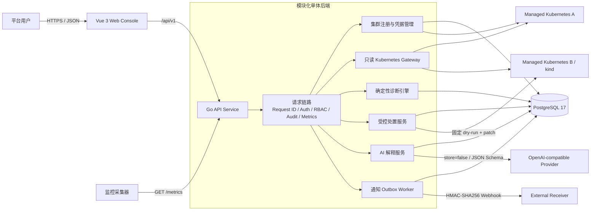
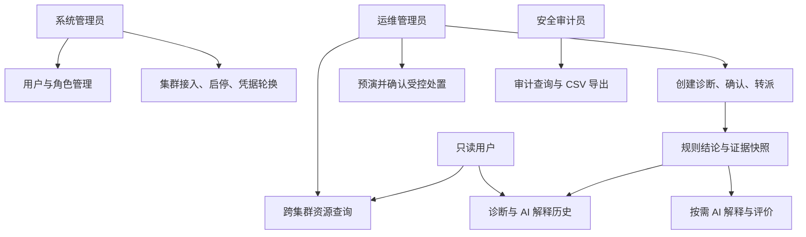
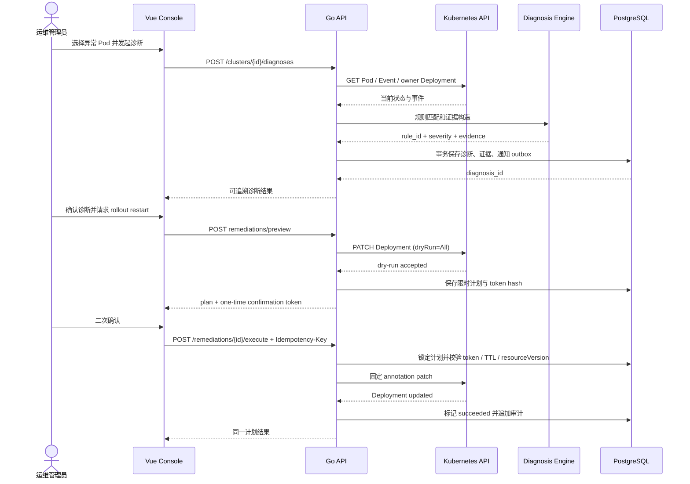

# System Diagrams

更新时间：2026-07-26

本页图表使用 Mermaid 保存为文本源，论文定稿时可统一导出为 SVG/PNG。图中只描述本项目自主实现的边界，不把参考项目组件作为系统组成部分。

## 系统架构图



## 角色与核心用例



## 核心数据 ER 图

```mermaid
erDiagram
    USERS }o--o{ ROLES : assigned_by_USER_ROLES
    USERS ||--o{ REFRESH_TOKENS : owns
    USERS ||--o{ AUDIT_LOGS : acts
    CLUSTERS ||--|| CLUSTER_CREDENTIALS : encrypts
    CLUSTERS ||--o{ CLUSTER_CONDITIONS : reports
    CLUSTERS ||--o{ DIAGNOSIS_RECORDS : scopes
    DIAGNOSIS_RECORDS ||--o{ DIAGNOSIS_EVIDENCE : contains
    DIAGNOSIS_RECORDS ||--o{ DIAGNOSIS_ACTIVITIES : tracks
    DIAGNOSIS_RECORDS ||--o{ DIAGNOSIS_ASSIGNMENTS : assigns
    DIAGNOSIS_RECORDS ||--o{ DIAGNOSIS_FEEDBACK : evaluates
    DIAGNOSIS_RECORDS ||--o{ AI_EXPLANATIONS : explains
    AI_EXPLANATIONS ||--o{ AI_EXPLANATION_FEEDBACK : evaluates
    DIAGNOSIS_RECORDS ||--o{ NOTIFICATION_DELIVERIES : publishes
    DIAGNOSIS_RECORDS ||--o{ REMEDIATION_PLANS : controls

    USERS {
        bigint id PK
        string username UK
        string password_hash
        int auth_version
        string status
    }
    CLUSTERS {
        bigint id PK
        string name UK
        string api_server
        bool enabled
    }
    CLUSTER_CREDENTIALS {
        bigint cluster_id PK_FK
        bytes ciphertext
        string key_version
    }
    DIAGNOSIS_RECORDS {
        bigint id PK
        bigint cluster_id FK
        string rule_id
        string resource_uid
        string status
        timestamp due_at
    }
    DIAGNOSIS_EVIDENCE {
        bigint id PK
        bigint diagnosis_id FK
        string evidence_type
        jsonb payload
    }
    AI_EXPLANATIONS {
        bigint id PK
        bigint diagnosis_id FK
        string model
        jsonb citations
        int input_tokens
        int output_tokens
    }
    REMEDIATION_PLANS {
        uuid id PK
        bigint diagnosis_id FK
        string action
        string target_uid
        string status
        timestamp expires_at
    }
```

## 诊断与受控处置时序图



## 安全边界说明

- 平台数据库不镜像保存 Kubernetes 实时对象，只保存平台元数据、诊断快照和审计记录。
- kubeconfig 使用 AES-256-GCM 加密，接口、日志、论文材料和验收证据均不得包含明文凭据。
- Kubernetes Gateway 是显式资源白名单，不提供任意 URL 代理。
- 受控处置只实现 `deployment.rollout_restart`，必须经过 confirmed 诊断、服务端 dry-run、一次性 token、resourceVersion 和幂等键校验。
- AI 位于确定性规则之后；失败、超时或预算不足不会改变诊断主结果。
